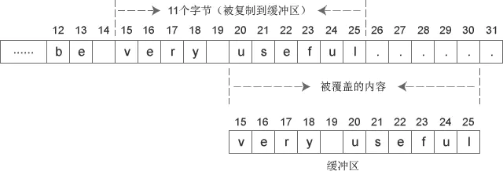
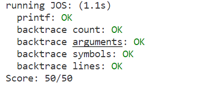

# PART2

第一个执行的指令是``ljmp`` ，地址在`0xffff0`，写成`(CS:IP)`形式就是`[f000:fff0]`。我们可以得到如下信息：

计算机启动后从``0xffff0``开始执行指令，也就是``CS=0xf000,IP=0xfff0``。
第一个执行的指令是一个跳转，跳转至`CS=0x3630,IP=0xf000e05b`，也就是`0xF0044356`。
这里还要介绍一下`(CS:IP)`和物理内存地址相互转化的规定，在所谓真实模式`real mode`下，换算的规则是：

```cpp
phy_addr = 16 * segment + offset = 16 * CS + IP
```
物理内存的`0xf0000-0x100000`这一段是所谓`BIOS`映射的，对这一段的读取就是在读取`BIOS`。物理内存地址并不是全都被内存芯片所包含，一些设备可以通过操作一些物理地址进而进行操作。如BIOS就是被映射到一段已知的地址上去了。

所谓BIOS就是`Basic IO Setup`，是引导内核不可或缺的一部分。CPU启动后Program Counter所在的地址`0xffff0`和BIOS映射区的顶部`0x100000`只差16,16个字节并不能做什么，也就需要`ljmp`一下，跳转到BIOS的开头开始执行。BIOS把处理器所能够触及的设备都初始化了一遍，完成之后从存储设备中加载内核引导器，也就是我们接下来看的。

现在的电脑可以通过其他的方式引导，而不一定使用BIOS，故BIOS在很多地方写作`BIOS Legacy`。
## question
* **处理器在什么时候开始执行 32 位代码？ 究竟是什么原因导致从 16 位模式切换到 32 位模式？**

看boot.S
在`ljmp $PROT_MODE_CSEG, $protcseg`处开始执行32位代码。应该是经过64与60端口的控制，加载完GDT表后，CRO的bit0位为1，此时机器已处于保护模式，故处理器从16位模式转为32位模式。

* **执行的引导加载程序的最后一个指令是什么， 它刚刚加载的内核的第一条指令是什么？**

引导器最后的指令和内核的第一个指令
打好断点，一直向前，就可以来到引导器的最后一个指令。

我们来到boot/main.c中bootmain函数的最后一行代码：

```cpp
((void (*)(void)) (ELFHDR->e_entry))();
```
这里将一个变量转化为函数指针，并调用这个函数。也就是令程序跳转到相应地址。看反汇编代码307行，程序跳转到地址*0x10018。
```
((void (*)(void)) (ELFHDR->e_entry))();
7d71:	ff 15 18 00 01 00    	call   *0x10018
```
我们可以猜测，这一定是内核的入口。要注意的是，这个call跳转的不是0x10018而是*0x10018。从地址0x10018中读取出跳转地址。真正的跳转地址在运行时决定，我们在bootmain函数最后一行打断点，并监听ELFHDR的值，可以看到`ELFHDR->e_entry`的值为1048588。转化为十六进制，就是`0x10000c`。

查看反汇编代码obj/kern/kernel.asm，可以看到，19行显示，内核第一个指令的地址是`0xf010000c`，而C代码中函数跳转是到`0x10000c`。

这个区别虚拟地址和物理地址的不同导致的。虚拟地址为ELF文件在产生时，连接器给函数绑定的地址。连接器也给这个ELF文件中其他很多变量绑定了地址，这些地址都是虚拟地址，整个由ELF文件定义的程序生活在虚拟地址的世界中。将文件加载进内存并开始执行后，处理器最终依据物理地址执行，若从虚拟地址到物理地址的映射不正确，加载的程序就不能正确执行。关于如何建立这样的地址映射，以后的Lab再关心。Lab1已经完成了这样的映射，内核若能正确加载，就能够正确执行。

* 内核的第一条指令在哪里？

位于/kern/entry.S文件中

* 引导加载程序如何决定它必须读取多少个扇区 为了从磁盘获取整个内核？ 它在哪里可以找到此信息？

通过ELF program headers决定，他在操作系统内核映像文件的ELF头部信息里找到。

* OS boot的时候 enable A20的意义是？\
A20的背景。还记得8088/8086有多少根地址线不？20根.那16位寄存器怎么表示20位的寻址空间呢？\
Intel用了分段的方法——segment:offset.
实际的地址是segment<< 4 + offset.举例说明，1000:FF03 表示的地址是 0x1000<< 4 + 0xFF03 即 0x1FF03
/boot/boot.S 中有中文释义
* some register and asm 
> 寄存器 \
CS(Code Segment) ——代码段寄存器 \
DS(Data Segment) ——数据段寄存器 \
SS(Stack Segment)—— 堆栈段寄存器 \
ES(Extra Segment)——扩展段寄存器 

>movx 指令
其中 x 可以是下面的字符：\
1，l用于32位的长字值 \
2，w用于16位的字值 \
3，b用于8位的字节值 

> lea是`load effective address`的缩写，简单的说，lea指令可以用来将一个内存地址直接赋给目的操作数，例如：```lea eax,[ebx+8]```就是将ebx+8这个值直接赋给eax，而不是把ebx+8处的内存地址里的数据赋给eax。而mov指令则恰恰相反，例如：```mov eax,[ebx+8]```则是把内存地址为ebx+8处的数据赋给eax。

>windows下汇编和linux下汇编这个参数顺序是反的(at&t语法和intel语法是反的！)

* ex7
```c
=> 0x7d6b:      call   *0x10018

Breakpoint 2, 0x00007d6b in ?? ()
(gdb) x/8w 0x100000
0x100000:       0x1badb002      0x00000000      0xe4524ffe      0x7205c766
0x100010:       0x34000004      0x2000b812      0x220f0011      0xc0200fd8
(gdb) x/8w 0xf0100000
0xf0100000 <_start+4026531828>: 0x00000000      0x00000000      0x00000000      0x00000000
0xf0100010 <entry+4>:   0x00000000      0x00000000      0x00000000      0x00000000
```
```c
=> 0x100028:    mov    $0xf010002f,%eax
0x00100028 in ?? ()
(gdb) x/8w 0xf0100000
0xf0100000 <_start+4026531828>: 0x1badb002      0x00000000      0xe4524ffe      0x7205c766
0xf0100010 <entry+4>:   0x34000004      0x2000b812      0x220f0011      0xc0200fd8
```
`movl %eax, %cr0`指令之后，0x00100000与0xf0100000后4个字完全相同了，我认为是分页后，0x00100000**映射**到了0xf0100000，完成了分页操作。

注释掉kern/entry.S line 62`movl	%eax, %cr0`之后
```c
qemu: fatal: Trying to execute code outside RAM or ROM at 0xf010002c

EAX=f010002c EBX=00010094 ECX=00000000 EDX=000000a4
ESI=00010094 EDI=00000000 EBP=00007bf8 ESP=00007bec
EIP=f010002c EFL=00000086 [--S--P-] CPL=0 II=0 A20=1 SMM=0 HLT=0
ES =0010 00000000 ffffffff 00cf9300 DPL=0 DS   [-WA]
CS =0008 00000000 ffffffff 00cf9a00 DPL=0 CS32 [-R-]
SS =0010 00000000 ffffffff 00cf9300 DPL=0 DS   [-WA]
DS =0010 00000000 ffffffff 00cf9300 DPL=0 DS   [-WA]
FS =0010 00000000 ffffffff 00cf9300 DPL=0 DS   [-WA]
GS =0010 00000000 ffffffff 00cf9300 DPL=0 DS   [-WA]
LDT=0000 00000000 0000ffff 00008200 DPL=0 LDT
TR =0000 00000000 0000ffff 00008b00 DPL=0 TSS32-busy
GDT=     00007c4c 00000017
IDT=     00000000 000003ff
CR0=00000011 CR2=00000000 CR3=00112000 CR4=00000000
DR0=00000000 DR1=00000000 DR2=00000000 DR3=00000000 
DR6=ffff0ff0 DR7=00000400
CCS=00000084 CCD=80010011 CCO=EFLAGS  
EFER=0000000000000000
FCW=037f FSW=0000 [ST=0] FTW=00 MXCSR=00001f80
FPR0=0000000000000000 0000 FPR1=0000000000000000 0000
FPR2=0000000000000000 0000 FPR3=0000000000000000 0000
FPR4=0000000000000000 0000 FPR5=0000000000000000 0000
FPR6=0000000000000000 0000 FPR7=0000000000000000 0000
XMM00=00000000000000000000000000000000 XMM01=00000000000000000000000000000000
XMM02=00000000000000000000000000000000 XMM03=00000000000000000000000000000000
XMM04=00000000000000000000000000000000 XMM05=00000000000000000000000000000000
XMM06=00000000000000000000000000000000 XMM07=00000000000000000000000000000000
```

* ex8

1. 解释printf.c和console.c之间的接口。具体来说，console.c 导出什么函数？printf.c如何使用这个函数？ \
kern/console.c 中定义了如何把一个字符显示到console上，即我们的显示屏之上，里面包括很多对IO端口的操作。\
lib/printfmt.c 中定义的子程序是我们能在编程时直接利用printf函数向屏幕输出信息的关键，是简化的原始 printf格式例程？ \
kern/printf.c 中定义的就是我们在编程中会用到的最顶层的一些格式化输出子程序。\
主要联系： 
```
printfmt.c 调用printf.c中的putch函数 
console.c调用printf.c中的cprintf函数 
printf.c又调用printfmt.c的vprintfmt函数 以及 console.c中的cputchar函数 
cputchar函数：打印一个字符到显示屏上 
putch函数：调用cputchar函数，并记录一共打印了多少字符 
vprintfmt函数：将参数fmt(eg. “%s have %d num”, s,n)打印，并将其中的转义字符(%s,%d)用对应参数(s,n)代替 
cprintf函数：类似标准输出。有多个输入参数，调用vcprintf函数，vcprintf函数再调用vprintfmt函数实现打印。
```

2. Explain the following from console.c:
```c
// 一页写满，滚动一行。
if (crt_pos >= CRT_SIZE) {
    int i;
    // 把从第1~n行的内容复制到0~(n-1)行，第n行未变化
    memmove(crt_buf, crt_buf + CRT_COLS, (CRT_SIZE - CRT_COLS) * sizeof(uint16_t));
    // 将第n行覆盖为默认属性下的空格
    for (i = CRT_SIZE - CRT_COLS; i < CRT_SIZE; i++)
        crt_buf[i] = 0x0700 | ' ';
    // 清空了最后一行，同步crt_pos
    crt_pos -= CRT_COLS;
}
```
memmove 函数
```c
memmove(crt_buf, crt_buf + CRT_COLS, (CRT_SIZE - CRT_COLS) * sizeof(uint16_t));
void * memmove(void *dest, const void *src, size_t num);
```
memmove 大部分情况下作用相当于 memcpy，但是加入了缓冲区，当src 和 dest 所指的内存区域重叠时，memmove() 仍然可以正确的处理，不过执行效率上会比使用 memcpy() 略慢些。


补充1: 如何通过ebp获取参数和局部变量
| 存储内容                | 内存地址        |
| ----------------------- | --------------- |
| 第 n 个参数             | ebp + 4 * (n+1) |
| 返回地址                | ebp + 4         |
| 上一级函数 ebp (旧 ebp) | ebp             |
| 第 m 个局部变量         | ebp - 4 * m     |

* ex11

利用read_ebp() 函数获取当前ebp值
利用 ebp 的初始值0判断是否停止
利用数组指针运算来获取 eip 以及 args
/kern/monitor mon_backtrace()

```c
0xf010ffb0:     0x00000004      0x00000005      0x00000000      0x00010094
0xf010ffc0:     0x00010094      0x00010094      0xf010fff8      0xf0100144
             +--------------------------------------------------------------+
             |    next x    |     this x     |  don't know   |  don't know  |
             +--------------+----------------+---------------+--------------+
             |  don't know  |    last ebx    |  last ebp     | return addr  |
             +------ -------------------------------------------------------+
             |     arg 1    |     arg 2      |    arg 3      |    arg 4     |
             +------ -------------------------------------------------------+
             |     arg 5    |     arg 6      |    arg 7      |    arg 8     |
             +------ -------------------------------------------------------+
```

* ex12
struct Stab
     Symnum是符号索引，换句话说，整个符号表看作一个数组，Symnum是当前符号在数组中的下标
     n_type是符号类型，FUN指函数名，SLINE指在text段中的行号
     n_othr目前没被使用，其值固定为0
     n_desc表示在文件中的行号
     n_value表示地址。特别要注意的是，这里只有FUN类型的符号的地址是绝对地址，SLINE符号的地址是偏移量，其实际地址为函数入口地址加上偏移量。比如第3行的含义是地址f01000b8(=0xf01000a6+0x00000012)对应文件第34行。

参考: https://blog.csdn.net/qq_43012789/article/details/107494408

# 总结
Bootload的启动过程可以概括如下：

首先，BIOS将第一块扇区（存着bootloader）读到内存中物理地址为0x7c00的位置，同时段寄存器CS值为0x0000，IP值为0x7c00，之后开始执行bootloader程序。CLI屏蔽中断（屏蔽所有的中断：为中断提供服务通常是操作系统设备驱动程序的责任，因此在bootloader的执行全过程中可以不必响应任何中断，中断屏蔽是通过写CPU提供的中断屏蔽寄存器来完成的）；CLD使DF复位，即DF=0，通过执行cld指令可以控制方向标志DF，决定内存地址是增大（DF=0，向高地址增加）还是减小（DF=1，向地地址减小）。设置寄存器 ax，ds，es，ss寄存器值为0；A20门被关闭，高于1MB的地址都默认回卷到0，所以要激活A20，给8042发命令激活A20，8042有两个IO端口：0x60和0x64， 激活流程： 发送0xd1命令到0x64端口 --> 发送0xdf到0x60，打开A20门。从实模式转换到保护模式（实模式将整个物理内存看成一块区域，程序代码和数据位于不同区域，操作系统和用户程序并没有区别对待，而且每一个指针都是指向实际的物理地址，地址就是IP值。这样，用户程序的一个指针如果指向了操作系统区域或其他用户程序区域，并修改了内容，那么其后果就很可能是灾难性的），所以就初始化全局描述符表使得虚拟地址和物理地址匹配可以相互转换；lgdt汇编指令把通过gdt处理后的（asm.h头文件中处理函数）描述符表的起始位置和大小存入gdtr寄存器中；将CR0的第0号位设置为1，进入保护模式；指令跳转由代码段跳到protcseg的起始位置。设置保护模式下数据段寄存器；设置堆栈寄存器并调用bootmain函数；



