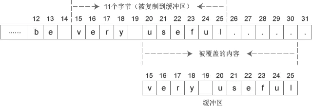
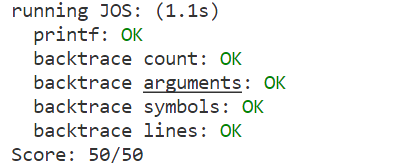

1. Lab 1: Booting a PC
   1. Part 1: PC Bootstrap
   2. Part 2: The Boot Loader
   3. Part 3: The Kernel
2. 总结

# Lab 1: Booting a PC
本实验分为三个部分。 第一部分集中于熟悉 使用 x86 汇编语言， QEMU x86模拟器， 以及 PC 的开机引导程序。 第二部分检查了 6.828 内核的引导加载程序， 它驻留在lab tree的`boot`目录中。 最后，第三部分深入研究初始模板 对于我们的 6.828 内核本身， 名叫`JOS`， 它驻留在`kern`目录中。
## Part 1: PC Bootstrap
A PC's physical address space is hard-wired to have the following general layout:
```

+------------------+  <- 0xFFFFFFFF (4GB)
|      32-bit      |
|  memory mapped   |
|     devices      |
|                  |
/\/\/\/\/\/\/\/\/\/\

/\/\/\/\/\/\/\/\/\/\
|                  |
|      Unused      |
|                  |
+------------------+  <- depends on amount of RAM
|                  |
|                  |
| Extended Memory  |
|                  |
|                  |
+------------------+  <- 0x00100000 (1MB)
|     BIOS ROM     |
+------------------+  <- 0x000F0000 (960KB)
|  16-bit devices, |
|  expansion ROMs  |
+------------------+  <- 0x000C0000 (768KB)
|   VGA Display    |
+------------------+  <- 0x000A0000 (640KB)
|                  |
|    Low Memory    |
|                  |
+------------------+  <- 0x00000000
```
第一台电脑， 基于 16 位英特尔 8088 处理器， 只能寻址 1MB 的物理内存。 早期 PC 的物理地址空间 因此，将从0x00000000开始 但以0x000FFFFF而不是0xFFFFFFFF结束。 标记为“内存不足”的 640KB 区域 是早期 PC 可以使用的唯一随机存取存储器 （RAM）; 事实上，最早的PC只能配置有 16KB、32KB 或 64KB 内存！

从0x000A0000到0x000FFFFF的 384KB 区域 由硬件保留用于特殊用途 如视频显示缓冲区 以及保存在非易失性存储器中的固件。 这个保留区域最重要的部分 是基本输入/输出系统 （BIOS）， 它占用从0x000F0000到0x000FFFFF的64KB区域。 在早期的PC中，BIOS保存在真正的只读存储器（ROM）中， 但当前的 PC 将 BIOS 存储在可更新的闪存中。 BIOS 负责执行基本的系统初始化 例如激活视频卡并检查安装的内存量。 执行此初始化后， BIOS 从某个适当的位置加载操作系统 如软盘、硬盘、光盘或网络， 并将机器的控制权传递给操作系统。

当英特尔终于“打破一兆字节的障碍” 使用 80286 和 80386 处理器， 分别支持 16MB 和 4GB 物理地址空间， 尽管如此，PC架构师仍然保留了原始布局 对于低 1MB 的物理地址空间 以确保与现有软件的向后兼容性。 因此，现代PC在物理内存中有一个“漏洞” 从0x000A0000到0x00100000， 将RAM分为“低”或“常规内存”（前640KB） 和“扩展内存”（其他所有内容）。 另外 PC 的 32 位物理地址空间顶部的一些空间， 最重要的是物理内存， 现在通常由 BIOS 保留 供 32 位 PCI 设备使用。

最近的x86处理器可以支持超过4GB的物理RAM， 因此，RAM 可以进一步扩展到 0xFFFFFFFF 以上。 在这种情况下，BIOS 必须安排留下第二个孔 在 32 位可寻址区域顶部的系统 RAM 中， 为要映射的这些 32 位设备留出空间。 由于设计限制 JOS 将仅使用前 256MB 无论如何，PC的物理内存， 所以现在我们将假装所有 PC “只有”一个 32 位物理地址空间。 但是处理复杂的物理地址空间 以及硬件组织的其他方面 经过多年的发展 是操作系统开发的重要实际挑战之一。

当 BIOS 运行时， 它设置中断描述符表 并初始化各种设备，例如 VGA 显示器。 这是“启动SeaBIOS”消息的地方 你在QEMU窗口中看到来自。

初始化 PCI 总线后 以及 BIOS 知道的所有重要设备， 它搜索可启动设备 如软盘、硬盘驱动器或 CD-ROM。 最终，当它找到可启动磁盘时， BIOS 从磁盘读取引导加载程序 并将控制权转移给它。
## Part 2: The Boot Loader

PC的软盘和硬盘是 分为 512 字节区域，称为扇区。 扇区是磁盘的最小传输粒度： 每个读取或写入操作的大小必须是一个或多个扇区 并在扇区边界上对齐。 如果磁盘可引导， 第一个扇区称为引导扇区， 因为这是引导加载程序代码所在的位置。 当 BIOS 找到可引导软盘或硬盘时， 它加载 512 字节引导扇区 到物理地址0x7c00到0x7dff的内存中， 然后使用 JMP 指令 将 CS：IP 设置为 0000：7c00， 将控制权传递给引导加载程序。 像 BIOS 加载地址一样， 这些地址相当随意 - 但它们对于 PC 来说是固定和标准化的。

计算机启动后从``0xffff0``开始执行指令，也就是``CS=0xf000,IP=0xfff0``。
第一个执行的指令是一个跳转，跳转至`CS=0x3630,IP=0xf000e05b`，也就是`0xF0044356`。
这里还要介绍一下`(CS:IP)`和物理内存地址相互转化的规定，在所谓真实模式`real mode`下，换算的规则是：

```cpp
phy_addr = 16 * segment + offset = 16 * CS + IP
```
物理内存的`0xf0000-0x100000`这一段是所谓`BIOS`映射的，对这一段的读取就是在读取`BIOS`。物理内存地址并不是全都被内存芯片所包含，一些设备可以通过操作一些物理地址进而进行操作。如BIOS就是被映射到一段已知的地址上去了。

所谓BIOS就是`Basic IO Setup`，是引导内核不可或缺的一部分。CPU启动后Program Counter所在的地址`0xffff0`和BIOS映射区的顶部`0x100000`只差16,16个字节并不能做什么，也就需要`ljmp`一下，跳转到BIOS的开头开始执行。BIOS把处理器所能够触及的设备都初始化了一遍，完成之后从存储设备中加载内核引导器，也就是我们接下来看的。

现在的电脑可以通过其他的方式引导，而不一定使用BIOS，故BIOS在很多地方写作`BIOS Legacy`。

从 CD-ROM 启动的能力出现得很晚 在PC的发展过程中， 结果，PC架构师抓住了这个机会 稍微重新考虑启动过程。 结果， 现代 BIOS 从 CD-ROM 启动的方式 有点复杂（也更强大）。 CD-ROM 使用的扇区大小为 2048 字节，而不是 512 字节， 并且 BIOS 可以将更大的启动映像从磁盘加载到内存中 （不仅仅是一个部门） 在将控制权移交给它之前。 

对于 6.828， 我们将使用传统的硬盘驱动器启动机制， 这意味着我们的引导加载程序必须适合可怜的 512 字节。 引导加载程序包括 一个汇编语言源文件，`boot/boot.S`， 和一个 C 源文件，`boot/main.c`

`obj/boot/boot.asm`。 此文件是引导加载程序的反汇编 我们的`GNUmakefile` 在编译引导加载程序后创建。 此反汇编文件使其易于查看 所有引导加载程序的代码在物理内存中的确切位置， 并更容易跟踪正在发生的事情 在 GDB 中单步执行引导加载程序时。 同样，`obj/kern/kernel.asm`包含对 JOS 内核，通常可用于调试。

* **处理器在什么时候开始执行 32 位代码？ 究竟是什么原因导致从 16 位模式切换到 32 位模式？**

>看boot.S \
在`ljmp $PROT_MODE_CSEG, $protcseg`处开始执行32位代码。应该是经过64与60端口的控制，加载完GDT表后，CRO的bit0位为1，此时机器已处于保护模式，故处理器从16位模式转为32位模式。

* **执行的引导加载程序的最后一个指令是什么， 它刚刚加载的内核的第一条指令是什么？**

引导器最后的指令和内核的第一个指令
打好断点，一直向前，就可以来到引导器的最后一个指令。

我们来到boot/main.c中bootmain函数的最后一行代码：

```cpp
((void (*)(void)) (ELFHDR->e_entry))();
```
这里将一个变量转化为函数指针，并调用这个函数。也就是令程序跳转到相应地址。看反汇编代码307行，程序跳转到地址*0x10018。
```
((void (*)(void)) (ELFHDR->e_entry))();
7d71:	ff 15 18 00 01 00    	call   *0x10018
```
我们可以猜测，这一定是内核的入口。要注意的是，这个call跳转的不是0x10018而是*0x10018。从地址0x10018中读取出跳转地址。真正的跳转地址在运行时决定，我们在bootmain函数最后一行打断点，并监听ELFHDR的值，可以看到`ELFHDR->e_entry`的值为1048588。转化为十六进制，就是`0x10000c`。

查看反汇编代码obj/kern/kernel.asm，可以看到，19行显示，内核第一个指令的地址是`0xf010000c`，而C代码中函数跳转是到`0x10000c`。

这个区别虚拟地址和物理地址的不同导致的。虚拟地址为ELF文件在产生时，连接器给函数绑定的地址。连接器也给这个ELF文件中其他很多变量绑定了地址，这些地址都是虚拟地址，整个由ELF文件定义的程序生活在虚拟地址的世界中。将文件加载进内存并开始执行后，处理器最终依据物理地址执行，若从虚拟地址到物理地址的映射不正确，加载的程序就不能正确执行。关于如何建立这样的地址映射，以后的Lab再关心。Lab1已经完成了这样的映射，内核若能正确加载，就能够正确执行。

* 内核的第一条指令在哪里？

>位于/kern/entry.S文件中

* 引导加载程序如何决定它必须读取多少个扇区 为了从磁盘获取整个内核？ 它在哪里可以找到此信息？

>通过ELF program headers决定，他在操作系统内核映像文件的ELF头部信息里找到。

* OS boot的时候 enable A20的意义是？

>A20的背景。还记得8088/8086有多少根地址线不？20根.那16位寄存器怎么表示20位的寻址空间呢？\
Intel用了分段的方法——segment:offset.
实际的地址是segment<< 4 + offset.举例说明，1000:FF03 表示的地址是 0x1000<< 4 + 0xFF03 即 0x1FF03
/boot/boot.S 中有中文释义

温习C语言
```c
#include <stdio.h>
#include <stdlib.h>
void f(void)
{
    int a[4];
    int *b = malloc(16);
    int *c;
    int i;
    //输出16进制格式
    printf("1: a = %p, b = %p, c = %p\n", a, b, c);
//  1: a = 0xbfa8bdbc, b = 0x9e3a160, c = (nil)
    c = a;
    for (i = 0; i < 4; i++)
	a[i] = 100 + i;
    c[0] = 200; //c和a存放的地址相同，c[0]改动a[0]也变化
    printf("2: a[0] = %d, a[1] = %d, a[2] = %d, a[3] = %d\n",
	   a[0], a[1], a[2], a[3]);
//  2: a[0] = 200, a[1] = 101, a[2] = 102, a[3] = 103

    c[1] = 300;
    *(c + 2) = 301; //等价于c[2]
    3[c] = 302;   //等价于c[3]
    printf("3: a[0] = %d, a[1] = %d, a[2] = %d, a[3] = %d\n",
	   a[0], a[1], a[2], a[3]);
// 3: a[0] = 200, a[1] = 300, a[2] = 301, a[3] = 302
    c = c + 1; //加一个元素
    *c = 400; //此时为c[1]地址
    printf("4: a[0] = %d, a[1] = %d, a[2] = %d, a[3] = %d\n",
	   a[0], a[1], a[2], a[3]);
// 4: a[0] = 200, a[1] = 400, a[2] = 301, a[3] = 302
    //测试如下
    //before: c = 0x7fffb5cc2884
    //after: c = 0x7fffb5cc2885
    //下面这行就是使得c里面存的地址+1
    //*c和a无关了
    c = (int *) ((char *) c + 1);
    *c = 500;
    printf("5: a[0] = %d, a[1] = %d, a[2] = %d, a[3] = %d\n",
	   a[0], a[1], a[2], a[3]);
// 5: a[0] = 200, a[1] = 128144, a[2] = 256, a[3] = 302
    b = (int *) a + 1; //加一个int的长度,4字节
    c = (int *) ((char *) a + 1); //加一个char的长度，1字节
    printf("6: a = %p, b = %p, c = %p\n", a, b, c);
// b = a + 4
// 6: a = 0xbfa8bdbc, b = 0xbfa8bdc0, c = 0xbfa8bdbd
}
int
main(int ac, char **av)
{
    f();
    return 0;
}
```
* Exercise 6 \
在BIOS进入Boot loader时检查内存的8个字在0x00100000处，然后在引导加载程序进入内核时再次检查。 他们为什么不同？ 第二个断点有什么？ （你真的不需要用QEMU来回答这个问题。试想一下)

答案应该很明显，在BIOS进入Boot loader时，0x100000内存后的8个字都为零，因为此时内核程序还没有加载进入内存。 内核的加载在bootmain函数中完成。 \
当bios进入bootloader时检查0x00100000处的内容，再在离开bootloader时检查一次。 \
由之前的exercise可知将两处断点设置为0x7c00和0x7d6b.

## Part 3: The Kernel


* Exercise 7 \
1.使用QEMU和GDB跟踪到JOS内核并停在movl％eax，％cr0。 检查内存为0x00100000和0xf0100000。 现在，使用stepi GDB命令单步执行该指令。 再次检查内存为0x00100000和0xf0100000。 确保你了解刚刚发生的事情。
```c
=> 0x7d6b:      call   *0x10018

Breakpoint 2, 0x00007d6b in ?? ()
(gdb) x/8w 0x100000
0x100000:       0x1badb002      0x00000000      0xe4524ffe      0x7205c766
0x100010:       0x34000004      0x2000b812      0x220f0011      0xc0200fd8
(gdb) x/8w 0xf0100000
0xf0100000 <_start+4026531828>: 0x00000000      0x00000000      0x00000000      0x00000000
0xf0100010 <entry+4>:   0x00000000      0x00000000      0x00000000      0x00000000
```
```c
=> 0x100028:    mov    $0xf010002f,%eax
0x00100028 in ?? ()
(gdb) x/8w 0xf0100000
0xf0100000 <_start+4026531828>: 0x1badb002      0x00000000      0xe4524ffe      0x7205c766
0xf0100010 <entry+4>:   0x34000004      0x2000b812      0x220f0011      0xc0200fd8
```
`movl %eax, %cr0`指令之后，0x00100000与0xf0100000后4个字完全相同了，我认为是分页后，0x00100000**映射**到了0xf0100000，完成了分页操作。

注释掉kern/entry.S line 62`movl	%eax, %cr0`之后
```c
qemu: fatal: Trying to execute code outside RAM or ROM at 0xf010002c

EAX=f010002c EBX=00010094 ECX=00000000 EDX=000000a4
ESI=00010094 EDI=00000000 EBP=00007bf8 ESP=00007bec
EIP=f010002c EFL=00000086 [--S--P-] CPL=0 II=0 A20=1 SMM=0 HLT=0
ES =0010 00000000 ffffffff 00cf9300 DPL=0 DS   [-WA]
CS =0008 00000000 ffffffff 00cf9a00 DPL=0 CS32 [-R-]
SS =0010 00000000 ffffffff 00cf9300 DPL=0 DS   [-WA]
DS =0010 00000000 ffffffff 00cf9300 DPL=0 DS   [-WA]
FS =0010 00000000 ffffffff 00cf9300 DPL=0 DS   [-WA]
GS =0010 00000000 ffffffff 00cf9300 DPL=0 DS   [-WA]
LDT=0000 00000000 0000ffff 00008200 DPL=0 LDT
TR =0000 00000000 0000ffff 00008b00 DPL=0 TSS32-busy
GDT=     00007c4c 00000017
IDT=     00000000 000003ff
CR0=00000011 CR2=00000000 CR3=00112000 CR4=00000000
DR0=00000000 DR1=00000000 DR2=00000000 DR3=00000000 
DR6=ffff0ff0 DR7=00000400
CCS=00000084 CCD=80010011 CCO=EFLAGS  
EFER=0000000000000000
FCW=037f FSW=0000 [ST=0] FTW=00 MXCSR=00001f80
FPR0=0000000000000000 0000 FPR1=0000000000000000 0000
FPR2=0000000000000000 0000 FPR3=0000000000000000 0000
FPR4=0000000000000000 0000 FPR5=0000000000000000 0000
FPR6=0000000000000000 0000 FPR7=0000000000000000 0000
XMM00=00000000000000000000000000000000 XMM01=00000000000000000000000000000000
XMM02=00000000000000000000000000000000 XMM03=00000000000000000000000000000000
XMM04=00000000000000000000000000000000 XMM05=00000000000000000000000000000000
XMM06=00000000000000000000000000000000 XMM07=00000000000000000000000000000000
```

* Exercise 8 \

1. 解释printf.c和console.c之间的接口。具体来说，console.c 导出什么函数？printf.c如何使用这个函数？
   
kern/console.c 中定义了如何把一个字符显示到console上，即我们的显示屏之上，里面包括很多对IO端口的操作。\
lib/printfmt.c 中定义的子程序是我们能在编程时直接利用printf函数向屏幕输出信息的关键，是简化的原始 printf格式例程？ \
kern/printf.c 中定义的就是我们在编程中会用到的最顶层的一些格式化输出子程序。\
主要联系： 
```
printfmt.c 调用printf.c中的putch函数 
console.c调用printf.c中的cprintf函数 
printf.c又调用printfmt.c的vprintfmt函数 以及 console.c中的cputchar函数 
cputchar函数：打印一个字符到显示屏上 
putch函数：调用cputchar函数，并记录一共打印了多少字符 
vprintfmt函数：将参数fmt(eg. “%s have %d num”, s,n)打印，并将其中的转义字符(%s,%d)用对应参数(s,n)代替 
cprintf函数：类似标准输出。有多个输入参数，调用vcprintf函数，vcprintf函数再调用vprintfmt函数实现打印。
```

2. Explain the following from console.c:
```c
// 一页写满，滚动一行。
if (crt_pos >= CRT_SIZE) {
    int i;
    // 把从第1~n行的内容复制到0~(n-1)行，第n行未变化
    memmove(crt_buf, crt_buf + CRT_COLS, (CRT_SIZE - CRT_COLS) * sizeof(uint16_t));
    // 将第n行覆盖为默认属性下的空格
    for (i = CRT_SIZE - CRT_COLS; i < CRT_SIZE; i++)
        crt_buf[i] = 0x0700 | ' ';
    // 清空了最后一行，同步crt_pos
    crt_pos -= CRT_COLS;
}
```
CRT_ROWS，CRT_COLS：CRT显示器行列最大值， 此处是25x80
ctr_buf 在初始化时指向了显示器I/O地址
memmove 函数
```c
memmove(crt_buf, crt_buf + CRT_COLS, (CRT_SIZE - CRT_COLS) * sizeof(uint16_t));
void * memmove(void *dest, const void *src, size_t num);
```
memmove 大部分情况下作用相当于 memcpy，但是加入了缓冲区，当src 和 dest 所指的内存区域重叠时，memmove() 仍然可以正确的处理，不过执行效率上会比使用 memcpy() 略慢些。



3. 跟踪执行以下代码，在调用cprintf()时，fmt, ap指向什么？
```c
int mon_backtrace(int argc, char **argv, struct Trapframe *tf)
{
	// Your code here.
        int x = 1, y = 3, z = 4;
        cprintf("x %d, y %x, z %d\n", x, y, z);
	return 0;
}
```
```c
// 从右向左压入参数
=> 0xf0100774 <mon_backtrace+6>:    push   $0x4
Breakpoint 1, mon_backtrace (argc=0, argv=0x0, tf=0x0) at kern/monitor.c:62
62      cprintf("x %d, y %x, z %d\n", x, y, z);
(gdb) si
=> 0xf0100776 <mon_backtrace+8>:    push   $0x3
0xf0100776  62      cprintf("x %d, y %x, z %d\n", x, y, z);
(gdb) 
=> 0xf0100778 <mon_backtrace+10>:   push   $0x1
0xf0100778  62      cprintf("x %d, y %x, z %d\n", x, y, z);
(gdb) 
=> 0xf010077a <mon_backtrace+12>:   push   $0xf0101b4e
0xf010077a  62      cprintf("x %d, y %x, z %d\n", x, y, z);
(gdb) 
// 跳转到函数
=> 0xf010077f <mon_backtrace+17>:   call   0xf010090b <cprintf>
0xf010077f  62      cprintf("x %d, y %x, z %d\n", x, y, z);
(gdb) 
// epb 内容入栈，保护先前的 ebp 信息
=> 0xf010090b <cprintf>:    push   %ebp
cprintf (fmt=0xf0101b4e "x %d, y %x, z %d\n") at kern/printf.c:27
27  {
(gdb) 
// 将 esp 内容复制到 ebp 中
=> 0xf010090c <cprintf+1>:  mov    %esp,%ebp
0xf010090c  27  {
(gdb) 
// cprintf 预留局部变量空间
=> 0xf010090e <cprintf+3>:  sub    $0x10,%esp
0xf010090e  27  {
(gdb) 
// ebp + 0xc 得出 arg2 的地址，并将该地址(而非内容)移入 eax
=> 0xf0100911 <cprintf+6>:  lea    0xc(%ebp),%eax
31      va_start(ap, fmt);
(gdb) 
// 参数 ap 入栈，即之前的 arg2 地址
=> 0xf0100914 <cprintf+9>:  push   %eax
32      cnt = vcprintf(fmt, ap);
(gdb) 
// 参数 fmt 入栈，即之前的 arg1
=> 0xf0100915 <cprintf+10>: pushl  0x8(%ebp)
0xf0100915  32      cnt = vcprintf(fmt, ap);
(gdb) 
=> 0xf0100918 <cprintf+13>: call   0xf01008e5 <vcprintf>
0xf0100918  32      cnt = vcprintf(fmt, ap);
(gdb) 
=> 0xf01008e5 <vcprintf>:   push   %ebp
vcprintf (fmt=0xf0101b4e "x %d, y %x, z %d\n", ap=0xf010ff04 "\001")
    at kern/printf.c:18
18  {
(gdb) 
=> 0xf01008e6 <vcprintf+1>: mov    %esp,%ebp
0xf01008e6  18  {
(gdb) 
=> 0xf01008e8 <vcprintf+3>: sub    $0x18,%esp
0xf01008e8  18  {
(gdb) 
=> 0xf01008eb <vcprintf+6>: movl   $0x0,-0xc(%ebp)
19      int cnt = 0;
(gdb) 
=> 0xf01008f2 <vcprintf+13>:    pushl  0xc(%ebp)
21      vprintfmt((void*)putch, &cnt, fmt, ap);
(gdb) 
=> 0xf01008f5 <vcprintf+16>:    pushl  0x8(%ebp)
0xf01008f5  21      vprintfmt((void*)putch, &cnt, fmt, ap);
(gdb) 
=> 0xf01008f8 <vcprintf+19>:    lea    -0xc(%ebp),%eax
0xf01008f8  21      vprintfmt((void*)putch, &cnt, fmt, ap);
```

从这个练习可以看出来，正是因为C函数调用实参的入栈顺序是从右到左的，才使得调用参数个数可变的函数成为可能(且不用显式地指出参数的个数)。但是必须有一个方式来告诉实际调用时传入的参数到底是几个，这个是在格式化字符串中指出的。如果这个格式化字符串指出的参数个数和实际传入的个数不一致，比如说传入的参数比格式化字符串指出的要少，就可能会使用到栈上错误的内存作为传入的参数，编译器必须检查出这样的错误 [2](https://github.com/clpsz/mit-jos-2014)。

补充1: 如何通过ebp获取参数和局部变量
| 存储内容                | 内存地址        |
| ----------------------- | --------------- |
| 第 n 个参数             | ebp + 4 * (n+1) |
| 返回地址                | ebp + 4         |
| 上一级函数 ebp (旧 ebp) | ebp             |
| 第 m 个局部变量         | ebp - 4 * m     |

4. 运行以下代码，输出结果是什么。
```c
unsigned int i = 0x00646c72;
cprintf("H%x Wo%s", 57616, &i);
```
调试出来输出了`Hello World`！ 57616的十六进制形式为E110, 因为是小端机，i的在内存中为0x72,0x6c,0x64,0x00. 对应ASCII为rld\0

6. 假设 GCC 更改了其调用约定，以便 按声明顺序在堆栈上推送参数， 以便最后一个参数被推到最后。 你必须如何改变或它 接口，以便仍然可以向其传递变量 参数数量？

因为传参是从左向右，而可变个数参数必须在参数列表的最后，所以有名参数最先入栈，可变参数最后入栈，这样在进入被调用函数时，栈空间的参数部分如下：

```
high    +------+
 ||     | fmt  |
 ||     | arg1 |
 ||     | arg2 |
 ||     | ...  |
 \/     | argn |
low     +------+
```

最后一个有名参数的地址是已知的，此处假设最后一个有名参数是fmt，因此va_start计算ap地址时，需要使用fmt的地址减去fmt占用的内存大小，即&fmt - 4。
而va_arg在更新当前参数指针地址时，也是要使用当前指针的值减去当前取的参数的占用的内存空间大小。


* Exercise 9 \
确定内核在什么时候初始化了堆栈，以及堆栈所在内存的确切位置。 内核如何为其堆栈保留空间？ 并且在这个保留区域的“end”是堆栈指针最初指向的位置吗？

1. entry.S 77行初始化栈
2. 栈的位置是0xf0108000-0xf0110000
3. 设置栈的方法是在kernel的数据段预留32KB空间(entry.S 92行)
4. 栈顶的初始化位置是0xf0110000

分析 bootloader最后一条语句进入内核，进入内核后的几件事情顺序如下：

开启分页(entry.S 62行)
设置栈指针(entry.S 77行)
调用i386_init(entry.S 80行)
设置栈指针的代码如下：
```assembly
    # Set the stack pointer
    movl    $(bootstacktop),%esp
```

可以从kern/kernel文件中找出符号bootstacktop的位置：

\$ objdump -D obj/kern/kernel | grep -3 bootstacktop
```c
f0108000 <bootstack>:
        ...

f0110000 <bootstacktop>:
f0110000:       01 10                   add    %edx,(%eax)
f0110002:       11 00                   adc    %eax,(%eax)
        ...
```
因为没有设置CS，因此CS还是指向之前在bootloader阶段设置的数据段描述符，该描述符指定的基地址为0x0，因此%esp的值就是栈顶的位置。因此栈顶的位置就是0xf0110000。 堆栈的大小由下面的指令设置(entry.S 92行):

```assembly
.data
###################################################################
# boot stack
###################################################################
    .p2align    PGSHIFT     # force page alignment
    .globl      bootstack
bootstack:
    .space      KSTKSIZE
    .globl      bootstacktop   
bootstacktop:
```
可以看出，栈的设置方法是在数据段中预留出一些空间来用作栈空间。memlayout.h 97行定义的栈的大小:
```c
#define PGSIZE      4096        // bytes mapped by a page
...
#define KSTKSIZE    (8*PGSIZE)          // size of a kernel stack
````
因此栈大小为`32KB`，栈的位置为`0xf0108000-0xf0110000`
可以看到，调用函数`i386_init`之前，栈的位置确实是在`0xff010000(%esp)`。查看栈的内容如下：
```c
(gdb) x /8xw 0xf010fff0
0xf010fff0:     0x00000000      0x00000000      0x00000000      0x00000000
0xf0110000 <entry_pgdir>:       0x00111021      0x00000000      0x00000000      0x0000000
```
第一个压入栈的数据应该是call i386_init的返回地址，即这条指令的下一条指令的地址，stepi单步之后再查看：
```c
(gdb) x /8xw 0xf010fff0
0xf010fff0:     0x00000000      0x00000000      0x00000000      0xf010003e
0xf0110000 <entry_pgdir>:       0x00111021      0x00000000      0x00000000      0x00000000
(gdb) x /2i 0xf0100039
   0xf0100039 <relocated+10>:   call   0xf010009d <i386_init>
   0xf010003e <spin>:   jmp    0xf010003e <spin>
```
再次查看栈中的内容验证了之前的猜测。
* Exercise 11 \

利用read_ebp() 函数获取当前ebp值
利用 ebp 的初始值0判断是否停止
利用数组指针运算来获取 eip 以及 args
/kern/monitor mon_backtrace()

```c
0xf010ffb0:     0x00000004      0x00000005      0x00000000      0x00010094
0xf010ffc0:     0x00010094      0x00010094      0xf010fff8      0xf0100144
             +--------------------------------------------------------------+
             |    next x    |     this x     |  don't know   |  don't know  |
             +--------------+----------------+---------------+--------------+
             |  don't know  |    last ebx    |  last ebp     | return addr  |
             +------ -------------------------------------------------------+
             |     arg 1    |     arg 2      |    arg 3      |    arg 4     |
             +------ -------------------------------------------------------+
             |     arg 5    |     arg 6      |    arg 7      |    arg 8     |
             +------ -------------------------------------------------------+
```

* Exercise 12 \

这个练习要求我们研究函数`debuginfo_eip`的实现，弄清楚命名为`__STAB_*`的几个宏的来历和作用，以及将`backtrace`功能作为命令加入`console`功能中。

命名为`__STAB_`的宏最早在文件`kern/kernel.ld` 中26行出现，`__STABSTR_`则在下面一点的34行出现。这个连接器的配置文件，要求连接器生成elf文件时，分配两个segment给到`.stab`和`.stabstr`，正如连接器也分配了`.data`等segment一样。

debuginfo_eip函数中的__STAB_*来自哪里？

`__STAB_BEGIN__，__STAB_END__，__STABSTR_BEGIN__，__STABSTR_END__`等符号均在kern/kern.ld文件定义，它们分别代表.stab和.stabstr这两个段开始与结束的地址。
```c
/* Include debugging information in kernel memory */
.stab : {
    PROVIDE(__STAB_BEGIN__ = .);
    *(.stab);
    PROVIDE(__STAB_END__ = .);
    BYTE(0)		/* Force the linker to allocate space
               for this section */
}

.stabstr : {
    PROVIDE(__STABSTR_BEGIN__ = .);
    *(.stabstr);
    PROVIDE(__STABSTR_END__ = .);
    BYTE(0)		/* Force the linker to allocate space
               for this section */
}
```
STABS（符号表字符串）是一种调试数据格式，用于存储有关计算机程序的信息，供符号和源代码级调试器使用。

汇编程序创建两个自定义部分，一个名为 .stab 的部分包含固定长度结构数组，每个 stab 一个结构，另一个名为 .stabstr 的部分包含 .stab 部分中的 stab 引用的所有可变长度字符串。
```c
struct Stab
     Symnum是符号索引，换句话说，整个符号表看作一个数组，Symnum是当前符号在数组中的下标
     n_type是符号类型，FUN指函数名，SLINE指在text段中的行号
     n_othr目前没被使用，其值固定为0
     n_desc表示在文件中的行号
     n_value表示地址。
     特别要注意的是，这里只有FUN类型的符号的地址是绝对地址，SLINE符号的地址是偏移量，
     其实际地址为函数入口地址加上偏移量。
     比如第3行的含义是地址f01000b8(=0xf01000a6+0x00000012)对应文件第34行。
```
objdump -G obj/kern/kernel
查看符号列表Symbol Table，得到有关函数和文件的信息，以下粘贴了部分kern/monitor.c文件有关的信息。
```c
obj/kern/kernel:     file format elf32-i386

Contents of .stab section:

Symnum n_type n_othr n_desc n_value  n_strx String
...  
375    FUN    0      0      f0100882 1790   mon_backtrace:F(0,1)
376    PSYM   0      0      00000008 1603   argc:p(0,1)
377    PSYM   0      0      0000000c 1768   argv:p(0,2)
378    PSYM   0      0      00000010 1780   tf:p(0,5)
379    SLINE  0      59     00000000 0      
380    SOL    0      0      f0100896 601    ./inc/x86.h
381    SLINE  0      214    00000014 0      
382    SOL    0      0      f0100898 1541   kern/monitor.c
...
```

ans

```c
int debuginfo_eip(uintptr_t addr, struct Eipdebuginfo *info)
{
    ···
    stab_binsearch(stabs, &lline, &rline, N_SLINE, addr);
    if (lline <= rline) {
        info->eip_line = stabs[lline].n_desc;
    } else {
        return -1;
    }
    ···
}
int mon_backtrace(int argc, char **argv, struct Trapframe *tf)
{
	// Your code here.
	// int x = 1, y = 3, z = 4;
	// cprintf("x %d, y %x, z %d\n", x, y, z);
	// 	Implement a backtrace function with the output format:
	// 利用read_ebp() 函数获取当前ebp值
	// 利用 ebp 的初始值0判断是否停止
	// 利用数组指针运算来获取 eip 以及 args
	uint32_t ebp, eip, *ptr_ebp;
	struct Eipdebuginfo info;
	ebp = read_ebp();
	cprintf("Stack backtrace:\n");
	while (ebp != 0)
	{
		ptr_ebp = (uint32_t *)ebp;
		eip = ptr_ebp[1];

		cprintf("ebp %x  eip %x  args %08x %08x %08x %08x %08x\n",
				ebp, eip, ptr_ebp[2], ptr_ebp[3], ptr_ebp[4], ptr_ebp[5], ptr_ebp[6]);

		int ret = debuginfo_eip(eip, &info);
		if (ret == 0){
			cprintf("%s:%d: %.*s+%d\n",
					info.eip_file, info.eip_line, info.eip_fn_namelen, info.eip_fn_name, eip - info.eip_fn_addr);
		}
		ebp = ptr_ebp[0];
	}
	return 0;
}
```

1. printf("%.*s", length, string) prints at most length characters of string.

参考: 
https://blog.csdn.net/qq_43012789/article/details/107494408 \
https://www.dingmos.com/index.php/archives/4/ \
https://zhuanlan.zhihu.com/p/112462553 \
# 总结
Bootload的启动过程可以概括如下：

首先，BIOS将第一块扇区（存着bootloader）读到内存中物理地址为0x7c00的位置，同时段寄存器CS值为0x0000，IP值为0x7c00，之后开始执行bootloader程序。CLI屏蔽中断（屏蔽所有的中断：为中断提供服务通常是操作系统设备驱动程序的责任，因此在bootloader的执行全过程中可以不必响应任何中断，中断屏蔽是通过写CPU提供的中断屏蔽寄存器来完成的）；CLD使DF复位，即DF=0，通过执行cld指令可以控制方向标志DF，决定内存地址是增大（DF=0，向高地址增加）还是减小（DF=1，向地地址减小）。设置寄存器 ax，ds，es，ss寄存器值为0；A20门被关闭，高于1MB的地址都默认回卷到0，所以要激活A20，给8042发命令激活A20，8042有两个IO端口：0x60和0x64， 激活流程： 发送0xd1命令到0x64端口 --> 发送0xdf到0x60，打开A20门。从实模式转换到保护模式（实模式将整个物理内存看成一块区域，程序代码和数据位于不同区域，操作系统和用户程序并没有区别对待，而且每一个指针都是指向实际的物理地址，地址就是IP值。这样，用户程序的一个指针如果指向了操作系统区域或其他用户程序区域，并修改了内容，那么其后果就很可能是灾难性的），所以就初始化全局描述符表使得虚拟地址和物理地址匹配可以相互转换；lgdt汇编指令把通过gdt处理后的（asm.h头文件中处理函数）描述符表的起始位置和大小存入gdtr寄存器中；将CR0的第0号位设置为1，进入保护模式；指令跳转由代码段跳到protcseg的起始位置。设置保护模式下数据段寄存器；设置堆栈寄存器并调用bootmain函数；


