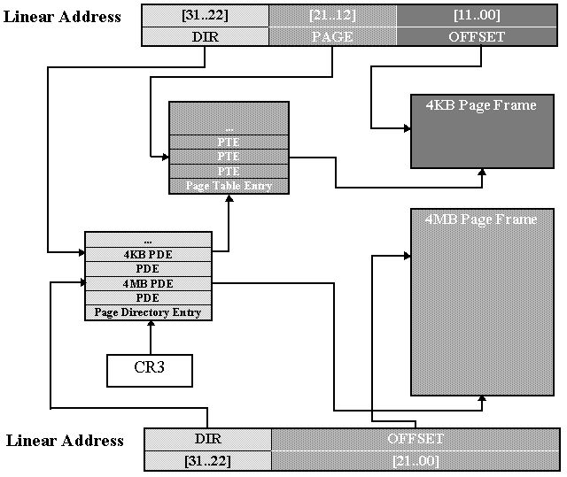

1. Lab 2: Memory Management
   1. Part 1: Physical Page Management
      1. 练习1：在kern/pmap.c文件中，为以下功能实现代码:
   2. Part 2: Virtual Memory
      1. 问题
   3. 习题 4.在文件 kern/pmap.c 中， 必须实现以下函数的代码。
   4. Part 3: Kernel Address Space
      1. 习题5 Fill in the missing code in mem\_init() after the call to check\_page().
      2. 问题
      3. 挑战:使用命令扩展 JOS 内核监视器
      4. 挑战:大页
      5. 挑战：dump 转储
      6. 挑战：buddy system


# Lab 2: Memory Management
在本实验中，您将为您的操作系统编写内存管理代码。 内存管理有两个组成部分。

第一个组件是内核的物理内存分配器，以便内核可以分配内存并稍后释放它。 您的分配器将以 4096 字节为单位运行，称为页面。 您的任务将是维护记录哪些物理页面是空闲的，哪些是已分配的，以及有多少进程正在共享每个已分配页面的数据结构。 您还将编写例程来分配和释放内存页。

内存管理的第二个组成部分是虚拟内存，它将内核和用户软件使用的虚拟地址映射到物理内存中的地址。 x86 硬件的内存管理单元 (MMU) 在指令使用内存时执行映射，并查阅一组页表。 您将修改 JOS 以根据我们提供的规范设置 MMU 的页表。

实验2包含以下新的源文件:
```
inc/memlayout.h：描述了必须通过修改pmap.c来实现的虚拟地址空间的布局
kern/pmap.c
kern/pmap.h：PageInfo 用于跟踪哪些物理内存页可用的结构
kern/kclock.h：操纵PC的电池供电时钟和CMOS RAM硬件，其中BIOS记录PC包含的物理内存量。
kern/kclock.c
```
## Part 1: Physical Page Management
操作系统必须跟踪物理RAM的哪些部分空闲以及当前正在使用哪些部分，现在，您将编写物理页面分配器：它使用struct PageInfo对象的链接列表（与xv6不同，它们不嵌入在空闲页面中）跟踪哪些页面是空闲的，每个对象都对应于一个物理页面。

在Lab 1中，我们做了一个虚拟内存映射，将0xf0000000-0xf0400000映射到物理地址0x00000000-00400000，总共大小为4MB。如果访问任何超出这个范围的虚拟地址，CPU都会出错。

在之后写代码时，代码中的地址都是虚拟地址，翻译成物理地址的过程是硬件实现的，我们不应该想着如何直接操作物理地址。但是，有时将地址转化物理地址可以方便一些操作，在文件inc/memlayout.h和kern/pmap.h中提供了一些宏和函数，方便我们做这样的地址换算。

首先提供了宏KERNBASE，注释说所有物理地址都被映射到这里，值为0xf0000000，正是我们映射的地址。所谓所有，就是已经映射过的地址，不包括还没映射的地址。

宏函数KADDR调用了函数_kaddr，将物理地址转化成内核地址，或称虚拟地址，也就是在物理地址的数值上加上了KERNBAE。此时的“所有”物理地址，范围还很小，因为其它的内存映射还没有建立，故可以这样简单地操作。其它内存映射建立之后，物理地址转化为虚拟地址的过程将很复杂。

相应的反向过程将虚拟地址转化为物理地址，宏函数PADDR做了这样的事情。也就是在输入的虚拟地址上减去KERNBASE，非常简单。

**重要变量和结构体**
```c
/*
 * kern/pmap.c
 */
// These variables are set by i386_detect_memory()
size_t npages;                 // Amount of physical memory (in pages)
static size_t npages_basemem;  // Amount of base memory (in pages)

// These variables are set in mem_init()
pde_t* kern_pgdir;                       // Kernel's initial page directory
                                         // 内核的初始页目录
struct PageInfo* pages;                  // Physical page state array
                                         // 物理页面状态数组
static struct PageInfo* page_free_list;  // Free list of physical pages
/*
 * inc/memlayout.h 
 */
struct PageInfo {
    // Next page on the free list.
    struct PageInfo *pp_link;
    // pp_ref 是指向此页的指针（通常在页表条目中）的计数，对于使用 page_alloc 分配的页。 
    // 在启动时使用 pmap.c 的 boot_alloc 分配的页面没有有效的引用计数字段。
    uint16_t pp_ref;
};
```

### 练习1：在kern/pmap.c文件中，为以下功能实现代码:
```c
boot_alloc()
mem_init()
page_init()
page_alloc()
page_free()
```
这两个部分的测试函数在 check_page_free_list() 和 check_page_alloc()，也许可以添加一点 assert() 进行验证。

```c
// 这个简单的物理内存分配器仅在 JOS 设置其虚拟内存系统时使用。 page_alloc() 是真正的分配器。
// 如果 n>0，则分配足够的连续物理内存页来容纳“n”个字节。 不初始化内存。 返回内核虚拟地址。
// 如果 n==0，则返回下一个空闲页的地址而不分配任何内容。
// 如果内存不足，boot_alloc 应该会崩溃。 这个函数只能在初始化期间使用，在 page_free_list 列表被设置之前。
static void* boot_alloc(uint32_t n) {
    static char* nextfree;  // virtual address of next byte of free memory
    char* result;

    // 如果这是第一次，则初始化 nextfree。 
    // 'end' 是由链接器自动生成的魔术符号，它指向内核 bss 段的末尾：
    // 第一个虚拟地址不会被分配给任何代码和全局变量！！！！  以前曾经尝试在0x000强制加入vma
    if (!nextfree) {
        extern char end[];
        nextfree = ROUNDUP((char*)end, PGSIZE);
    }

    // 分配一个足够大的块来容纳n字节 跟新nextfree 
    // 确保 nextfree % PGSIZE == 0

    // LAB 2: Your code here.
    if (n == 0) 
        return nextfree;
    
    // note before update
    result = nextfree;
    nextfree = ROUNDUP(n, PGSIZE) + nextfree;

    // out of memory panic
    if (nextfree > (char*)0xf0400000) {
        panic("boot_alloc: out of memory, nothing changed, returning NULL...\n");
        nextfree = result;  // reset static data
        return NULL;
    }
    return result;
}
```

利用 objdump -h kernel可以看出，bss 段已经是内核的最后一段。因此，end 指向的是第一个未使用的虚拟内存地址。

```c
root@ubuntu:~/6.828train/obj/kern# objdump -h kernel

kernel:     file format elf32-i386

Sections:
Idx Name          Size      VMA       LMA       File off  Algn
  0 .text         000040d9  f0100000  00100000  00001000  2**4
                  CONTENTS, ALLOC, LOAD, READONLY, CODE
  1 .rodata       00001170  f01040e0  001040e0  000050e0  2**5
                  CONTENTS, ALLOC, LOAD, READONLY, DATA
  2 .stab         00006841  f0105250  00105250  00006250  2**2
                  CONTENTS, ALLOC, LOAD, READONLY, DATA
  3 .stabstr      00001e24  f010ba91  0010ba91  0000ca91  2**0
                  CONTENTS, ALLOC, LOAD, READONLY, DATA
  4 .data         00009300  f010e000  0010e000  0000f000  2**12
                  CONTENTS, ALLOC, LOAD, DATA
  5 .got          0000000c  f0117300  00117300  00018300  2**2
                  CONTENTS, ALLOC, LOAD, DATA
  6 .got.plt      0000000c  f011730c  0011730c  0001830c  2**2
                  CONTENTS, ALLOC, LOAD, DATA
  7 .data.rel.local 00001000  f0118000  00118000  00019000  2**12
                  CONTENTS, ALLOC, LOAD, DATA
  8 .data.rel.ro.local 00000044  f0119000  00119000  0001a000  2**2
                  CONTENTS, ALLOC, LOAD, DATA
  9 .bss          00000674  f0119060  00119060  0001a060  2**5
                  CONTENTS, ALLOC, LOAD, DATA
 10 .comment      00000029  00000000  00000000  0001a6d4  2**0
                  CONTENTS, READONLY
```

```c
// Set up a two-level page table:
//    kern_pgdir is its linear (virtual) address of the root
//    kern_pgdir 是其根的线性（虚拟）地址
// This function only sets up the kernel part of the address space
// (ie. addresses >= UTOP).  The user part of the address space
// will be set up later.
// 这个函数之设置内核部分空间 (ie. addresses >= UTOP)
// 从 UTOP 到 ULIM，允许用户读但不能写。
// 在 ULIM 以上，用户无法读取或写入。
void mem_init(void) {
    uint32_t cr0;
    size_t n;

    // Find out how much memory the machine has (npages & npages_basemem).
    i386_detect_memory();

    //////////////////////////////////////////////////////////////////////
    // 创建初始页面目录。
    kern_pgdir = (pde_t*)boot_alloc(PGSIZE);
    memset(kern_pgdir, 0, PGSIZE);

    //////////////////////////////////////////////////////////////////////
    // Recursively insert PD in itself as a page table, to form
    // a virtual page table at virtual address UVPT.
    // (For now, you don't have understand the greater purpose of the
    // following line.)
    // 递归地将PD本身作为页表插入，在虚拟地址UVPT处形成虚拟页表。
    // Permissions: kernel R, user R
    kern_pgdir[PDX(UVPT)] = PADDR(kern_pgdir) | PTE_U | PTE_P;

    //////////////////////////////////////////////////////////////////////
    // Allocate an array of npages 'struct PageInfo's and store it in 'pages'.
    // The kernel uses this array to keep track of physical pages: for
    // each physical page, there is a corresponding struct PageInfo in this
    // array.  'npages' is the number of physical pages in memory.  Use memset
    // to initialize all fields of each struct PageInfo to 0.
    // Your code goes here:
    pages = (struct PageInfo*)boot_alloc(npages * sizeof(struct PageInfo));
    memset(pages, 0, npages * sizeof(struct PageInfo));

    //////////////////////////////////////////////////////////////////////
    // 已经分配了初始的内核数据结构 设置了 the list of free physical pages
    // 之后所有的内存管理斗由 page_* functions
    // In particular, we can now map memory using boot_map_region or page_insert
    page_init();

    check_page_free_list(1);
    check_page_alloc();
    check_page();

    //////////////////////////////////////////////////////////////////////
    // Now we set up virtual memory

    //////////////////////////////////////////////////////////////////////
    // Map 'pages' read-only by the user at linear address UPAGES
    // Permissions:
    //    - the new image at UPAGES -- kernel R, user R
    //      (ie. perm = PTE_U | PTE_P)
    //    - pages itself -- kernel RW, user NONE
    // Your code goes here:
    // Map 'pages' read-only by the user at linear address UPAGES
    boot_map_region(kern_pgdir, UPAGES, npages * sizeof(struct PageInfo),
                    PADDR(pages), PTE_U);

    //////////////////////////////////////////////////////////////////////
    // 使用物理内存 bootstack 代表内核栈
    // 内核栈从 KSTACKTOP 开始增长  范围[KSTACKTOP-PTSIZE, KSTACKTOP)
    // break this into two pieces:
    //     * [KSTACKTOP-KSTKSIZE, KSTACKTOP) -- 由物理内存支持
    //     * [KSTACKTOP-PTSIZE, KSTACKTOP-KSTKSIZE) -- 不支持 对付内核栈溢出
    //       Known as a "guard page".
    //     Permissions: kernel RW, user NONE
    // Your code goes here:
    // Use the physical memory that 'bootstack' refers to as the kernel
    boot_map_region(kern_pgdir, KSTACKTOP - KSTKSIZE, KSTKSIZE, PADDR(bootstack), PTE_W);

    //////////////////////////////////////////////////////////////////////
    // Map all of physical memory at KERNBASE.
    // Ie.  the VA range [KERNBASE, 2^32) should map to
    //      the PA range [0, 2^32 - KERNBASE)
    // We might not have 2^32 - KERNBASE bytes of physical memory, but
    // we just set up the mapping anyway.
    // Permissions: kernel RW, user NONE
    // Your code goes here:
    // Map all of physical memory at KERNBASE.
    boot_map_region(kern_pgdir, KERNBASE, 0xffffffff - KERNBASE, 0, PTE_W);

    // Check that the initial page directory has been set up correctly.
    check_kern_pgdir();

    // Switch from the minimal entry page directory to the full kern_pgdir
    // page table we just created.	Our instruction pointer should be
    // somewhere between KERNBASE and KERNBASE+4MB right now, which is
    // mapped the same way by both page tables.
    // 从最小入口页面目录切换到我们刚刚创建的完整 kern_pgdir 页表。 
    // 我们的指令指针现在应该位于 KERNBASE 和 KERNBASE+4MB 之间，这两个页表以相同的方式映射。
    // 如果此时机器重新启动，您可能设置了错误的 kern_pgdir。
    lcr3(PADDR(kern_pgdir));

    check_page_free_list(0);

    // entry.S 在 cr0 中设置真正重要的标志（包括启用分页）。 在这里，我们配置我们关心的其余标志。
    cr0 = rcr0();
    cr0 |= CR0_PE | CR0_PG | CR0_AM | CR0_WP | CR0_NE | CR0_MP;
    cr0 &= ~(CR0_TS | CR0_EM);
    lcr0(cr0);

    // Some more checks, only possible after kern_pgdir is installed.
    check_page_installed_pgdir();
}
```

打印出相关信息查看：
```c
npages: 32768
npages_basemem: 160
PGNUM(PADDR(kern_pgdir)): 279
PGNUM(boot_alloc(0)): 344
PGNUM((void*)EXTPHYSMEM): 256
PGNUM((void*)IOPHYSMEM): 160
```
```c
// --------------------------------------------------------------
// Tracking of physical pages.
// 'pages' 数组每个物理页面有一个 'struct PageInfo' 条目。 页面被引用计数，空闲页面保存在链表中。
// --------------------------------------------------------------
// 初始化 page structure 和 page_free_list
// 完成之后废弃boot_alloc
// 只通过page_free_list来allocate and deallocate physical memory
//
void page_init(void)
{
	// The example code here marks all physical pages as free.
	// However this is not truly the case.  What memory is free?
	//  1) Mark physical page 0 as in use.
	//     This way we preserve the real-mode IDT and BIOS structures
	//     in case we ever need them.  (Currently we don't, but...)
	//  2) The rest of base memory, [PGSIZE, npages_basemem * PGSIZE)
	//     is free.
	//  3) Then comes the IO hole [IOPHYSMEM, EXTPHYSMEM), which must
	//     never be allocated.
	//  4) Then extended memory [EXTPHYSMEM, ...).
	//     Some of it is in use, some is free. Where is the kernel
	//     in physical memory?  Which pages are already in use for
	//     page tables and other data structures?

	// Change the code to reflect this.
	// NB: DO NOT actually touch the physical memory corresponding to
	// free pages!

	//  1) Mark physical page 0 as in use.
    // 这样我们就可以保留实模式 IDT 和 BIOS 结构，以备不时之需。 （目前我们没有，但是......）
	pages[0].pp_ref = 1;

	//  2) The rest of base memory, [PGSIZE, npages_basemem * PGSIZE) is free.
	size_t i;
	for (i = 1; i < npages_basemem; i++)
	{
		pages[i].pp_ref = 0;
		pages[i].pp_link = page_free_list;
		page_free_list = &pages[i];
	}
	//  3) Then comes the IO hole [IOPHYSMEM, EXTPHYSMEM), which must
	//     never be allocated.
	for (i = npages_basemem; i < EXTPHYSMEM / PGSIZE; i++)
		pages[i].pp_ref = 1;
	//  4) Then extended memory [EXTPHYSMEM, ...).
	//     Some of it is in use, some is free. Where is the kernel
	//     in physical memory?  Which pages are already in use for
	//     page tables and other data structures?
	// first需要向上取整对齐。同时此时已经工作在虚拟地址模式（entry.S对内存进行了映射）下，
	// 需要求得first的物理地址
	physaddr_t first_free_addr = PADDR(boot_alloc(0));
	size_t first_free_page = first_free_addr / PGSIZE;
	for (i = EXTPHYSMEM / PGSIZE; i < first_free_page; i++)
		pages[i].pp_ref = 1;
	// mark other pages as free
	for (i = first_free_page; i < npages; i++)
		pages[i].pp_ref = 0;
		pages[i].pp_link = page_free_list;
		page_free_list = &pages[i];
}
```
一个从KERNBASE开始的内存布局图 [ref](https://zhuanlan.zhihu.com/p/176967610)
```c
/*
 *                     .                              .
 *                     .       Managable Space        .
 *                     .                              .
pages ends 0x158000 -->+------------------------------+
 *                     |                              |
 *                     .                              .
 *                     .   pages management array     .
 *                     .                              .
 *                     |                              |
 *  pages 0x118000 ->  +------------------------------+
 *                     |        Kernel is here        |
 *    EXT 0x100000 ->  +------------------------------+
 *                     |                              |
 *                     |          IO Hole             |
 *                     |                              |
 * BASEMEM 0xa0000 ->  +------------------------------+
 *                     |    Basic Managable Space     |
 *    KERNBASE ----->  +------------------------------+
 */
```
从`KERNBASE`开始想起。回顾Lab 1我们知道，内存`0xf0000-0x100000`是`BIOS`映射区，在这之前又是`ROM`映射区，这段空间不能使用，不能被分配器分配出去。查看讲义，我们知道，地址`0xa0000-0x100000`是`ROM`, `BIOS`等IO使用的内存，不可以被分配，初始化时应排除这部分空间。在文件`inc/memlayout.h`中，宏`IOPHYSMEM`定义了这段IO段内存的开头。

在`IOPHYSMEM之`前还有一些内存没有分配，这部分内存是可以使用的。函数`i386_detect_memory`得到的`npages_basemem`就是这一段的长度，初始化page分配器时应该包含这一段。可以验证一下，`npages_basemem`的值为`160`，这么多个`page`总的大小为`160 * 4096 = 655360 = 0xa0000`，确实是`IOPHYSMEM`！

从`0x100000`开始以上的内存就是内核，可以回顾Lab 1中探索内核结构的结果，内核的.text区的虚拟地址为`0xf0100000`，物理地址正是`0x100000`。文件`inc/memlayout.h`中定义的宏`EXTPHYSMEM`就是`0x100000`，意思是`BIOS`以上的内存，称为拓展区，其上限由RAM硬件大小决定。
```c
// 分配一个物理页
// If (alloc_flags & ALLOC_ZERO) 填充'\0'
// 不增加页面的引用计数 - 调用者必须在必要时执行这些操作（显式或通过 page_insert）。
//
// Be sure to set the pp_link field of the allocated page to NULL so
// 以便 page_free 可以检查是否存在双重释放错误。
//
// Returns NULL if out of free memory.
// Hint: use page2kva and memset
struct PageInfo *page_alloc(int alloc_flags)
{
	struct PageInfo *pp;
	// no changes made so far of course
	if (!page_free_list)
		return NULL;

	pp = page_free_list;                      // 移除出空闲队列
	page_free_list = page_free_list->pp_link; // update free list pointer
	pp->pp_link = NULL;						  // set to NULL according to notes
	// page2kva 返回值 KernelBase + 物理页号<<PGSHIFT,  虚拟地址
	if (alloc_flags & ALLOC_ZERO)
	{
		void *va = page2kva(pp); // extract kernel virtual memory 获取地址
		memset(va, '\0', PGSIZE);
	}
	return pp;
	return 0;
}

// Return a page to the free list.
// pp->pp_ref == 0 加入 page_free_list 释放页面
void page_free(struct PageInfo *pp)
{
	// Fill this function in
	// Hint: You may want to panic if pp->pp_ref is nonzero or
	// pp->pp_link is not NULL.
	if (pp->pp_link || pp->pp_ref)
		panic("pp->pp_ref is nonzero or pp->pp_link is not NULL\n");

	pp->pp_link = page_free_list;
	page_free_list = pp;
}
```

## Part 2: Virtual Memory

虚拟，线性和物理地址
在x86术语中，虚拟地址由段选择器和段内的偏移量组成: 一个线性地址 是段转换之后但页面翻译之前得到的东西，物理地址是转换完全之后得到的。

### 问题
1. Assuming that the following JOS kernel code is correct, what type should variable x have, uintptr_t or physaddr_t?
```c
	mystery_t x;
	char* value = return_a_pointer();
	*value = 10;
	x = (mystery_t) value;
```
因为value为指针类型，是虚拟地址，因此x的类型应为uintptr_t

| C type     | Address type |
| ---------- | ------------ |
| T*         | Virtual      |
| uintptr_t  | Virtual      |
| physaddr_t | Physical     |

虚拟内存
当 cpu 拿到一个地址并根据地址访问内存时，在 x86架构下要经过至少两级的地址变换：段式变换和页式变换。分段机制的主要目的是将代码段、数据段以及堆栈段分开，保证互不干扰。分页机制则是为了实现虚拟内存。
虚拟内存主要的好处是：

让每个程序都以为自己独占计算机内存空间，概念清晰，方便程序的编译和装载。
通过将部分内存暂存在磁盘上，可以让程序使用比物理内存大得多的虚拟内存，突破物理内存的限制。
通过对不同进程设置不同页表，可以防止进程访问其他进程的地址空间。通过在不同进程之间映射相同的物理页，又可以提供进程间的共享。

```c
           Selector  +--------------+         +-----------+
          ---------->|              |         |           |
                     | Segmentation |         |  Paging   |
Software             |              |-------->|           |---------->  RAM
            Offset   |  Mechanism   |         | Mechanism |
          ---------->|              |         |           |
                     +--------------+         +-----------+
            Virtual                   Linear                Physical
```
[Chapter 5 Memory Management](https://pdos.csail.mit.edu/6.828/2018/readings/i386/c05.htm)
80386 转换逻辑地址（即由 程序员）变成物理地址（即物理地址中的实际地址） 内存）分两步：
* 段转换，其中逻辑地址（由 段选择器和段偏移量）转换为线性地址。
* 页面转换，其中线性地址转换为物理地址 地址。此步骤是可选的，由系统软件自行决定 设计师。


在 boot/boot.S中，我们安装了全局描述符表（GDT），该表通过将所有段基址设置为0并将限制设置为来有效地禁用段转换0xffffffff。因此，“选择器”无效，线性地址始终等于虚拟地址的偏移量。在实验3中，我们将需要与分段进行更多的交互才能设置特权级别，但是对于 lab2 内存转换，我们可以在整个JOS实验中忽略分段，而只关注页面转换。


在 JOS 中，由于只有一个段，所以虚拟地址数值上等于线性地址。
JOS 内核常常需要读取或更改仅知道物理地址的内存。例如，添加一个到页表的映射要求分配物理内存来存储页目录并初始化内存。然而，内核和其他任何程序一样，无法绕过虚拟内存转换这个步骤，因此不能直接使用物理地址。JOS 将从 0x00000000 开始的物理内存映射到 0xf0000000 的其中一个原因就是需要使内核能读写仅知道物理地址的内存。为了把物理地址转为虚拟地址，内核需要给物理地址加上 0xf0000000。这就是 KADDR 函数做的事。
同样，JOS 内核有时也需要从虚拟地址获得物理地址。内核的全局变量和由 boot_alloc 分配的内存都在内核被加载的区域，即从0xf0000000开始的地方。因此，若需要将虚拟地址转为物理地址，直接减去0xf0000000即可。这就是 PADDR 函数做的事。

如果这里我们要将一个虚拟地址和物理地址相互转换的话，可以使用定义在 pmap.h 里面的：
```c
KADDR(pa)
PADDR(va)

// The PDX, PTX, PGOFF, and PGNUM macros decompose linear addresses as shown.
// To construct a linear address la from PDX(la), PTX(la), and PGOFF(la),
// use PGADDR(PDX(la), PTX(la), PGOFF(la)).

// page number field of address
#define PGNUM(la)   (((uintptr_t) (la)) >> PTXSHIFT)

// page directory index
// 取31到22 bit
#define PDX(la)     ((((uintptr_t) (la)) >> PDXSHIFT) & 0x3FF)

// page table index
// 取21到12 bit
#define PTX(la)     ((((uintptr_t) (la)) >> PTXSHIFT) & 0x3FF)

// offset in page
// 取11到0 bit
#define PGOFF(la)   (((uintptr_t) (la)) & 0xFFF)

 
#define PGADDR(d, t, o) ((void*) ((d) << PDXSHIFT | (t) << PTXSHIFT | (o)))

// Page directory and page table constants.
#define NPDENTRIES  1024        // page directory entries per page directory
#define NPTENTRIES  1024        // page table entries per page table

#define PGSIZE      4096        // bytes mapped by a page, 4kB
#define PGSHIFT     12      // log2(PGSIZE)

#define PTSIZE      (PGSIZE*NPTENTRIES) // bytes mapped by a page directory entry, 4MB
#define PTSHIFT     22      // log2(PTSIZE)

#define PTXSHIFT    12      // offset of PTX in a linear address
#define PDXSHIFT    22      // offset of PDX in a linear address

// The PTE_AVAIL bits aren't used by the kernel or interpreted by the
// hardware, so user processes are allowed to set them arbitrarily.
#define PTE_AVAIL   0xE00   // Available for software use

// Flags in PTE_SYSCALL may be used in system calls.  (Others may not.)
#define PTE_SYSCALL (PTE_AVAIL | PTE_P | PTE_W | PTE_U)

// Address in page table or page directory entry
// 将页目录项的后12位（flag 位）全部置 0 获得对应的页表项物理地址
#define PTE_ADDR(pte)   ((physaddr_t) (pte) & ~0xFFF)
```
还有一些页表以及页目录会用到的标识位，exercise 4 中用得到的用中文注释：
```c
// Page table/directory entry flags.
#define PTE_P       0x001   // 该项是否存在
#define PTE_W       0x002   // 可写入
#define PTE_U       0x004   // 用户有权限读取
#define PTE_PWT     0x008   // Write-Through
#define PTE_PCD     0x010   // Cache-Disable
#define PTE_A       0x020   // Accessed
#define PTE_D       0x040   // Dirty
#define PTE_PS      0x080   // Page Size
#define PTE_G       0x100   // Global
```

## 习题 4.在文件 kern/pmap.c 中， 必须实现以下函数的代码。
        pgdir_walk()
        boot_map_region()
        page_lookup()
        page_remove()
        page_insert()

pgdir_walk 函数

作用是查找一个虚拟地址对应的页表项地址，需要完成如图的转换，返回对应的页表地址，即红圈圈出的部分的虚拟地址：
```c
// 给定一个页目录表指针 pgdir ，该函数应该返回线性地址va所对应的页表项指针。
// pgdir_walk返回指向线性地址“va”的页表项（PTE）的指针。这需要遍历两级页面表结构。
pte_t* pgdir_walk(pde_t* pgdir, const void* va, int create) {
    // 参数1: 页目录项指针
    // 参数2: 线性地址，JOS 中等于虚拟地址
    // 参数3: 若页目录项不存在是否创建
    // 返回: 页表项指针
    // 　1. 通过页目录表求得这个虚拟地址所在的页表页对于与页目录中的页目录项地址
    uint32_t pdx = PDX(va);  // 页目录项索引
    uint32_t ptx = PTX(va);  // 页表项索引
    pde_t* pde;              // 页目录项指针
    pte_t* pte;              // 页表项指针
    struct PageInfo* pp;

    pde = &pgdir[pdx];  // 获取页目录项
    // 2. 判断这个页目录项对应的页表页是否已经在内存中。
    if (*pde & PTE_P) {
        // 3.
        // 如果在，计算这个页表页的基地址page_base，然后返回va所对应页表项的地址
        // PTE_ADDR得到物理地址，KADDR转为虚拟地址
        pte = (KADDR(PTE_ADDR(*pde)));
    } else {
        // 二级页表不存在，
        if (!create) {
            return NULL;
        }
        // 4.
        // 如果不在则，且create为true则分配新的页，并且把这个页的信息添加到页目录项pde中。
        //  获取一页的内存，创建一个新的页表，来存放页表项
        if (!(pp = page_alloc(ALLOC_ZERO))) {
            return NULL;
        }
        pte = (pte_t*)page2kva(pp);
        pp->pp_ref++;
        *pde = PADDR(pte) | (PTE_P | PTE_W | PTE_U);  // 设置页目录项
    }
    // 返回页表项的虚拟地址
    return &pte[ptx];
}
```
page_lookup 函数，作用是查找虚拟地址对应的物理页描述。
```c
struct PageInfo* page_lookup(pde_t* pgdir, void* va, pte_t** pte_store) {
    // 参数1: 页目录指针
    // 参数2: 线性地址，JOS 中等于虚拟地址
    // 参数3: 指向页表指针的指针
    // 返回: 页描述结构体指针
    pte_t* pte = pgdir_walk(pgdir, va, 0);
    if (pte == NULL)  // no page mapped at va
        return NULL;
    if (!(*pte & PTE_P))  // 考虑页表项是否存在
        return NULL;
    if (pte_store) {
        *pte_store = pte;
    }
    struct PageInfo* ret = pa2page(PTE_ADDR(*pte));
    // 用到了 PTE_ADDR 这个宏。其作用是将页表指针指向的内容转为物理地址。
    return ret;
}
```
page_remove 函数,作用是移除一个虚拟地址与对应的物理页的映射。
```c
void page_remove(pde_t* pgdir, void* va) {
    pte_t* pte;
    struct PageInfo* pageInfo = page_lookup(pgdir, va, &pte);  // PageInfo
    if (pageInfo == NULL)
        return;  // page not mapped
    page_decref(pageInfo);  // 减少引用，如果为0，free
    *pte = 0;               // set pte not present
    tlb_invalidate(pgdir, va);
}
```
page_insert 函数,作用是建立一个虚拟地址与物理页的映射

```c
// Map the physical page 'pp' at virtual address 'va'.
// The permissions (the low 12 bits) of the page table entry
// should be set to 'perm|PTE_P'.
//
// Requirements
//   - If there is already a page mapped at 'va', it should be page_remove()d.
//   - If necessary, on demand, a page table should be allocated and inserted
//     into 'pgdir'.
//   - pp->pp_ref should be incremented if the insertion succeeds.
//   - The TLB must be invalidated if a page was formerly present at 'va'.
//
// Corner-case hint: Make sure to consider what happens when the same
// pp is re-inserted at the same virtual address in the same pgdir.
// However, try not to distinguish this case in your code, as this
// frequently leads to subtle bugs; there's an elegant way to handle
// everything in one code path.
//
// RETURNS:
//   0 on success
//   -E_NO_MEM, if page table couldn't be allocated
//
// Hint: The TA solution is implemented using pgdir_walk, page_remove,
// and page2pa.
//
int page_insert(pde_t* pgdir, struct PageInfo* pp, void* va, int perm) {
    // 参数1: 页目录指针
    // 参数2: 页描述结构体指针
    // 参数3: 线性地址，JOS 中等于虚拟地址
    // 参数4: 权限
    // 返回: 成功(0)，失败(-E_NO_MEM)
    // 1. 首先通过pgdir_walk函数求出虚拟地址va所对应的页表项。 如果没有 分配一个
    pte_t* pte = pgdir_walk(pgdir, va, 1);
    if (!pte) {
        return -E_NO_MEM;  // 错误是负数
    }
    // 2. 修改pp_ref的值。 要先加再去判断是不是映射过了，因为3中涉及到了删除
    pp->pp_ref++;
    // 3. 查看这个页表项，确定va是否已经被映射，如果被映射，则删除这个映射。
    if ((*pte) & PTE_P)  // If this virtual address is already mapped. 先删掉
    {
        page_remove(pgdir, va);
    }
    // 4. 把va和pp之间的映射关系加入到页表项中。
    *pte = (page2pa(pp) | perm | PTE_P);
    pgdir[PDX(va)] |= perm;  // Remember this step!
    return 0;
}
```
boot_map_region() 
这个函数将虚拟地址中的几个page映射到连续的物理地址上。代码很简单，利用刚刚写好的函数pgdir_walk，给参数create传1，就可以方便地建立page table

注意此时的 va 类型是 uintptr_t，调用 pgdir_walk 时需要转换为 void *。
```c
// Map [va, va+size) of virtual address space to physical [pa, pa+size) in the page table rooted at pgdir.  
// 大小是PGSIZE整数倍  va and pa页对齐
// permission bits : perm|PTE_P 
//
// 此函数仅用于在 UTOP 之上设置“静态”映射。 因此，它不应该更改映射页面上的 pp_ref 字段。
//
// Hint: the TA solution uses pgdir_walk
static void boot_map_region(pde_t* pgdir,uintptr_t va,size_t size,physaddr_t pa,int perm) {
    // 计算总共有多少页
    size_t pgs = PAGE_ALIGN(size) >> PGSHIFT;  
    // 更新pa和va，进行下一轮循环
    for (int i = 0; i < pgs; i++, pa += PGSIZE, va += PGSIZE) 
    {
        // 获取va对应的PTE的地址 create if not exists
        pte_t* pte = pgdir_walk(pgdir, (void*)va, 1);  
        if (pte == NULL)
            panic("boot_map_region(): out of memory\n");
        *pte = pa | PTE_P | perm;  // 修改va对应的PTE的值
    }
}
```
## Part 3: Kernel Address Space
权限和故障隔离
由于内核和用户内存 都存在于每个环境的地址空间中， 我们将不得不在 x86 页表中使用权限位来 仅允许用户代码访问地址空间的用户部分。 否则，用户代码中的错误可能会覆盖内核数据， 导致崩溃或更微妙的故障; 用户代码也可能能够窃取其他环境的私有数据。注意 可写权限位 （PTE_W） 同时影响用户和 内核代码！

用户环境将无权访问任何 内存以上，而内核将能够 读取和写入此内存。对于地址范围，内核和用户环境都有 相同的权限：他们可以读取但不能写入此地址范围。 此地址范围用于公开某些内核数据结构 对用户环境只读。最后，下面的地址空间供用户环境使用;用户环境 将设置访问此内存的权限。ULIM[UTOP,ULIM)UTOP

```c
inc/memlayout.h
/*
 * Virtual memory map:                                Permissions
 *                                                    kernel/user
 *
 *    4 Gig -------->  +------------------------------+
 *                     |                              | RW/--
 *                     ~~~~~~~~~~~~~~~~~~~~~~~~~~~~~~~~
 *                     :              .               :
 *                     :              .               :
 *                     :              .               :
 *                     |~~~~~~~~~~~~~~~~~~~~~~~~~~~~~~| RW/--
 *                     |                              | RW/--
 *                     |   Remapped Physical Memory   | RW/--
 *                     |                              | RW/--
 *    KERNBASE, ---->  +------------------------------+ 0xf0000000      --+
 *    KSTACKTOP        |     CPU0's Kernel Stack      | RW/--  KSTKSIZE   |
 *                     | - - - - - - - - - - - - - - -|                   |
 *                     |      Invalid Memory (*)      | --/--  KSTKGAP    |
 *                     +------------------------------+                   |
 *                     |     CPU1's Kernel Stack      | RW/--  KSTKSIZE   |
 *                     | - - - - - - - - - - - - - - -|                 PTSIZE
 *                     |      Invalid Memory (*)      | --/--  KSTKGAP    |
 *                     +------------------------------+                   |
 *                     :              .               :                   |
 *                     :              .               :                   |
 *    MMIOLIM ------>  +------------------------------+ 0xefc00000      --+
 *                     |       Memory-mapped I/O      | RW/--  PTSIZE
 * ULIM, MMIOBASE -->  +------------------------------+ 0xef800000
 *                     |  Cur. Page Table (User R-)   | R-/R-  PTSIZE
 *    UVPT      ---->  +------------------------------+ 0xef400000
 *                     |          RO PAGES            | R-/R-  PTSIZE
 *    UPAGES    ---->  +------------------------------+ 0xef000000
 *                     |           RO ENVS            | R-/R-  PTSIZE
 * UTOP,UENVS ------>  +------------------------------+ 0xeec00000
 * UXSTACKTOP -/       |     User Exception Stack     | RW/RW  PGSIZE
 *                     +------------------------------+ 0xeebff000
 *                     |       Empty Memory (*)       | --/--  PGSIZE
 *    USTACKTOP  --->  +------------------------------+ 0xeebfe000
 *                     |      Normal User Stack       | RW/RW  PGSIZE
 *                     +------------------------------+ 0xeebfd000
 *                     |                              |
 *                     |                              |
 *                     ~~~~~~~~~~~~~~~~~~~~~~~~~~~~~~~~
 *                     .                              .
 *                     .                              .
 *                     .                              .
 *                     |~~~~~~~~~~~~~~~~~~~~~~~~~~~~~~|
 *                     |     Program Data & Heap      |
 *    UTEXT -------->  +------------------------------+ 0x00800000
 *    PFTEMP ------->  |       Empty Memory (*)       |        PTSIZE
 *                     |                              |
 *    UTEMP -------->  +------------------------------+ 0x00400000      --+
 *                     |       Empty Memory (*)       |                   |
 *                     | - - - - - - - - - - - - - - -|                   |
 *                     |  User STAB Data (optional)   |                 PTSIZE
 *    USTABDATA ---->  +------------------------------+ 0x00200000        |
 *                     |       Empty Memory (*)       |                   |
 *    0 ------------>  +------------------------------+                 --+
 *
 * (*) Note: The kernel ensures that "Invalid Memory" is *never* mapped.
 *     "Empty Memory" is normally unmapped, but user programs may map pages
 *     there if desired.  JOS user programs map pages temporarily at UTEMP.
 */
```
### 习题5 Fill in the missing code in mem_init() after the call to check_page().

JOS 将处理器的 32 位线性地址分为用户环境（低位地址）以及内核环境（高位地址）。分界线在 inc/memlayout.h 中定义为 ULIM：
```c
#define KERNBASE    0xF0000000
// Kernel stack.
#define KSTACKTOP   KERNBASE
// Memory-mapped IO.
#define MMIOLIM     (KSTACKTOP - PTSIZE)
#define MMIOBASE    (MMIOLIM - PTSIZE)
#define ULIM        (MMIOBASE)
```
其中 PTSIZE 被定义为一个页目录项映射的 Byte，一个页目录中有1024个页表项，每个页表项可映射一个物理页。故为 4MB。可算得 ULIM = 0xf0000000 - 0x00400000 - 0x00400000 = 0xef800000，可通过查看 inc/memlayout 确认。 \
我们还需要给物理页表设置权限以确保用户只能访问用户环境的地址空间。否则，用户的代码可能会覆盖内核数据，造成严重后果。用户环境应该在高于 ULIM 的内存中没有任何权限，而内核则可以读写着部分内存。在 UTOP( 0xeec00000) 到 ULIM 的 12MB 区间中，存储了一些内核数据结构。内核以及用户环境对这部分地址都只具有 read-only 权限。低于 UTOP 的内存则由用户环境自由设置权限使用。

该练习中主要映射了三段虚拟地址到物理页上。

1. UPAGES (0xef000000 ~ 0xef400000) 最多4MB \
这是 JOS 记录物理页面使用情况的数据结构，即 exercise 1 中完成的东西，只有 kernel 能够访问。由于用户空间同样需要访问这个数据结构，我们将用户空间的一块内存映射到存储该数据结构的物理内存上。很自然联想到了 boot_map_region 这个函数。 \
需要注意的是目前只建立了一个页目录，即 kernel_pgdir，所以第一个参数显然为 kernel_pgdir。第二个参数是虚拟地址，UPAGES 本来就是以虚拟地址形式给出的。第三个参数是映射的内存块大小。第四个参数是映射到的物理地址，直接取 pages 的物理地址即可。权限 PTE_U 表示用户有权限读取。

2. 内核栈 ( 0xefff8000 ~ 0xf0000000) 32kB \
bootstack 表示的是栈地最低地址，由于栈向低地址生长，实际是栈顶。常数 KSTACKTOP = 0xf0000000，KSTKSIZE = 32kB。在此之下是一块未映射到物理内存的地址，所以如果栈溢出时，只会报错而不会覆盖数据。因此我们只用映射 [KSTACKTOP-KSTKSIZE, KSTACKTOP) 区间内的虚拟地址即可。
再次说一下权限问题。这里设置了 PTE_W 开启了写权限，然而并没有开启 PTE_U，于是仅有内核能够读写，用户没有任何权限。

3. 内核 ( 0xf0000000 ~ 0xffffffff ) 256MB \
之前在 lab1 中，通过 kernel/entrypgdir.c 映射了 4MB 的内存地址，这里需要映射全部 0xf0000000 至 0xffffffff 共 256MB 的内存地址。

运行到这里，出现了一个不易察觉到问题。注意到，这里的 size 参数做了roundup，也就是说从 0x0fffffff 变为了 0x10000000。在 boot_map_region 中，再利用 va + size，显然会溢出得0。于是就会出现如下现象：
[ref](https://www.jianshu.com/p/3be92c8228b6)
```c
...
va = 0xef035000
va = 0xef036000
va = 0xef037000
va = 0xef038000
va = 0xef039000
va = 0xef03a000
va = 0xef03b000
va = 0xef03c000
va = 0xef03d000
va = 0xef03e000
va = 0xef03f000
size = 32768, 8 pages
va = 0xefff8000
va = 0xefff9000
va = 0xefffa000
va = 0xefffb000
va = 0xefffc000
va = 0xefffd000
va = 0xefffe000
va = 0xeffff000
size = 268435456, 65536 pages
kernel panic at kern/pmap.c:696: assertion failed: check_va2pa(pgdir, KERNBASE + i) == i
...
```
即 boot_map_region 中的 for 循环一开始就判断 va > end_addr。这是显然的，因为 end_addr = 0xf0000000 + 0x1000000 = 0x00000000。 \
实际上 boot_map_region 的更佳实现是直接用页数，避免溢出。

对比如下
```c
for (;va < end_addr; va += PGSIZE, pa += PGSIZE) 
for (int i = 0; i < pgs; i++, pa += PGSIZE, va += PGSIZE)  // 更新pa和va，进行下一轮循环
```

###  问题
1. 页面目录中的哪些条目（行）已填写？他们映射什么地址，并指向何处？

| Entry | Base Virtual Address | Points to (logically)                      |
| ----- | -------------------- | ------------------------------------------ |
| 1023  | 0xffc00000           | Page table for [252,256) MB of phys memory |
| ...   | ...                  | ...                                        |
| 961   | 0xf0400000           | Page table for [4,8) MB of phys memory     |
| 960   | 0xf0000000           | Page table for [0,4) MB of phys memory     |
| 959   | 0xefc00000           | Current page table, kernel RW              |
| 958   | 0xef800000           | (0xefbfe000 - 0xefc00000 Kernel stack)     |
|       |                      | (0xef800000 - 0xefbfe000 Invalid memory)   |
| 957   | 0xef400000           | Current page table kernel R-, user R-      |
| 956   | 0xef000000           | User pages                                 |
| 955   | 0xeec00000           |                                            |
| ...   | ...                  |                                            |
| 1     | 0x00400000           |                                            |
| 0     | 0x00000000           | <Nothing, mapping got cleared>             |

2. 我们已将内核和用户环境放置在同一地址空间中。 为什么用户程序无法读取或写入内核内存？ 哪些具体机制保护内核内存？

这是因为虚拟内存被 ULIM 和 UTOP 分成了段。 (ULIM, 4GB)是Kernel only，(UTOP, ULIM] Kernel和User环境都可以读，[0x0, UTOP]是User环境空间。这些内存空间有权限位保护，比如PTE_W（可写） 和 PTE_U（用户），它们在页表/目录条目标志中设置。

用于保护的具体机制是Current Privilege Level (CPL)，即CS的低2位。 CPL=0 是特权操作系统，CPL=3 是用户。 这用于检测当前模式以及我们是否可以写入虚拟内存地址。

3. 该操作系统可以支持的最大物理内存量是多少？ 为什么？

注意到，pages 这个数组只能占用最多 4MB 的空间，而每个 PageInfo 占用 8Byte，也就是说最多只能有512k页，每页容量4kB，总共最多 2GB。

4. 如果我们实际上拥有最大数量的物理内存，那么管理内存有多少空间开销？ 这个开销是如何分解的？

4MB多一点。 有页表和页目录。 从讲座中，我们有 1024 页表和 1 页目录。 因此总空间开销 = 4KB * 1024 + 4KB。

5. 重新访问 kern/entry.S 和 kern/entrypgdir.c 中的页表设置。 在我们打开分页后，EIP 仍然是一个较低的数字（略高于 1MB）。 我们在什么时候过渡到在 KERNBASE 之上的 EIP 上运行？ 是什么让我们在启用分页和开始以高于 KERNBASE 的 EIP 运行之间继续以低 EIP 执行成为可能？ 为什么这种转变是必要的？
```assembly
    # Now paging is enabled, but we're still running at a low EIP
    # (why is this okay?).  Jump up above KERNBASE before entering
    # C code.
    mov $relocated, %eax
    jmp *%eax
relocated:

    # Clear the frame pointer register (EBP)
    # so that once we get into debugging C code,
    # stack backtraces will be terminated properly.
    movl    $0x0,%ebp           # nuke frame pointer

    # Set the stack pointer
    movl    $(bootstacktop),%esp

    # now to C code
    call    i386_init
```
语句jmp *%eax即转到 eax 所存的地址执行，在这里完成了跳转。relocated 部分代码主要设置了栈指针以及调用 kern/init.c。由于在 kern/entrypgdir.c 中将 0~4MB 和 KERNBASE ~ KERNBASE + 4 MB 的虚拟地址都映射到了 0~4MB 的物理地址上，因此无论 EIP 在高位和低位都能执行。必需这么做是因为如果只映射高位地址，那么在开启分页机制的下一条语句就会crash。


### 挑战:使用命令扩展 JOS 内核监视器

* 以有用且易于阅读的格式显示 所有物理页面映射（或缺少） 适用于特定范围的虚拟/线性地址 在当前活动的地址空间中。 例如 您可以输入“显示映射0x3000 0x5000”以显示物理页面映射 和相应的权限位 适用于页面 在虚拟地址 0x3000、0x4000 和 0x5000。
* 显式设置、清除或更改权限 当前地址空间中的任何映射。
* 转储内存范围的内容 给定虚拟或物理地址范围。 确保转储代码行为正常 当范围跨页面边界扩展时！
```c
int mon_showmappings(int argc, char** argv, struct Trapframe* tf) {
    // 参数检查
    static const char* msg = "Usage: showmaps <start> [<length>]\n";

    if (argc < 2)
        goto usage;

    char* errChar;
    uintptr_t start_addr = (uintptr_t)strtol(argv[1], &errChar, 16);
    if (*errChar) {
        cprintf("Invalid virtual address: %s.\n", argv[1]);
        return -1;
    }
    size_t vlen = argc >= 3 ? (size_t)strtol(argv[2], 0, 0) : 1;
    uintptr_t end_addr = start_addr + vlen;
    if (*errChar) {
        cprintf("Invalid virtual address: %s.\n", argv[2]);
        return -1;
    }
    if (start_addr > end_addr) {
        cprintf("start_addr > end_addr Address error maybe overflow \n");
        return -1;
    }
    // 按页对齐
    start_addr = ROUNDDOWN(start_addr, PGSIZE);
    end_addr = ROUNDDOWN(end_addr, PGSIZE);
    // 开始循环
    uintptr_t cur_addr = start_addr;
    cprintf("| Virtual address | physical address | permission |\n");
    cprintf("| --------------- | ---------------- | ---------- |\n");
    while (cur_addr <= end_addr) {
        pte_t* cur_pte = pgdir_walk(kern_pgdir, (void*)cur_addr, 0);
        // 记录自己一个错误
        // if ( !cur_pte) {
        if (cur_pte && *cur_pte & PTE_P) {
            cprintf("| 0x%08x      | not mapped       | ---------- |\n",
                    cur_addr);
        } else {
            // 进入 else 分支说明 PTE_P 肯定为真了
            cprintf(
                "| 0x%08x      | 0x%08x       | -%c----%c%cP  |\n",
                cur_addr, PTE_ADDR(*cur_pte), (*cur_pte & PTE_PS) ? 'S' : '-',
                (*cur_pte & PTE_W) ? 'W' : '-', (*cur_pte & PTE_U) ? 'U' : '-');
        }
        cur_addr += PGSIZE;
    }
    return 0;
usage:
    cprintf(msg);
    return 0;
}
```

```c
int mon_setperm(int argc, char** argv, struct Trapframe* tf) {
    static const char* msg = "Usage: setperm <virtual address> <permission>\n";

    if (argc != 3)
        goto usage;

    uintptr_t va;
    uint16_t perm;
    pte_t* pte;
    char* errChar;

    va = (uintptr_t)strtol(argv[1], &errChar, 0);
    if (*errChar) {
        cprintf("Invalid virtual address: %s.\n", argv[1]);
        return -1;
    }
    perm = (uint16_t)strtol(argv[2], &errChar, 0);
    if (*errChar) {
        cprintf("Invalid perm: %s.\n", argv[2]);
        return -1;
    };

    pte = pgdir_walk(kern_pgdir, (void*)va, 0);
    if (pte && *pte & PTE_P) {
        *pte = (*pte & ~0xFFF) | (perm & 0xFFF) | PTE_P;
		cprintf("SET PERM SUCC\n");
    } else {
        cprintf("VA NOT MAPPED\n");
    }
    return 0;

usage:
    cprintf(msg);
    return 0;
}
```


### 挑战:大页
根据Intel IA-32 Manual Volume 3中的描述，使用4MB的大页，需要若干条件：

* CR4的PSE位置位，启动大页扩展。
* PDE的PS位置位，表示该PDE指向一个大页。
* 大页指向的物理地址基址为4MB对齐的。


混合 4-KByte 和 4-MByte 页面的一个典型例子是将操作系统或执行内核放在一个大页面中，以减少 TLB 未命中，从而提高整体系统性能。 处理器在单独的 TLB 中维护 4-MByte 页面条目和 4-KByte 页面条目。 因此，将经常使用的代码（如内核）放在一个大页面中，可以为应用程序和任务释放 4 KB 页面的 TLB 条目。

首先在装载新的页表前设置CR4的PSE位：

```c
// Enable page size extension
cr4 = rcr4();
cr4 |= CR4_PSE;
lcr4(cr4);
```
定义一个新的boot_map_region_huge_page函数，用于在映射KERNBASE以上区域时进行大页映射：
```c
static void boot_map_region_huge_page(pde_t* pgdir,
                                      uintptr_t va,
                                      size_t size,
                                      physaddr_t pa,
                                      int perm) {
    size_t off;

    if (va & (PTSIZE - 1) || pa & (PTSIZE - 1) || size & (PTSIZE - 1))
        panic("boot_map_region_huge_page wrong!!");
    cprintf("va %x\n", size);
    for (off = 0; off < size; off += PTSIZE) {
        // 不用查pte了 直接改
        pgdir[PDX(va + off)] = (pa + off) | perm | PTE_P | PTE_PS;
    }
}
```
对于物理页的分配，仅一处改用了这里的large page，即KERNBASE往上的空间：
```c
#ifdef CONF_HUGE_PAGE
    boot_map_region_huge_page(kern_pgdir, KERNBASE, ~(uint32_t)0 - KERNBASE + 1,
                              0, PTE_W);
#else
    boot_map_region(kern_pgdir, KERNBASE, 0xffffffff - KERNBASE, 0, PTE_W);
#endif
```
* 虽然buddy system里设置的最大连续page frame是1024也即4MB，但是这个数字是不太可靠的，如果只有512那可能就没法依赖了
* 这个page分配是用于初始化阶段的，大部分物理内存都是空白的，因此区别也不大，后续只应当使用malloc和free，因此也无碍
```c
// 分配大页
struct PageInfo* huge_page_alloc(int alloc_flags) {
    // Fill this function in
    struct PageInfo *start, *current, *end, *jmp;
    jmp = start = current = page_free_list;
    end = pages + npages;
    // no changes made so far of course
    if (!page_free_list)
        return NULL;
    int cnt;
    // bound check
    while (current < end) {
        cnt = 0;
        // stop when at least one conditions met:
        // 1. array overflow(current>=end)
        // 2. pages to allocated is broken by an aleady occupied
        // page(current->pp_link==NULL)
        // 3. page count reachs NPTENTRIES(1024) 
        while (current < end && current->pp_link && cnt < NPTENTRIES) {
            current++;
            cnt++;
        }

        // when while-loop is broken for adequate pages
        // deal with pointer update and return
        if (cnt == NPTENTRIES) {
            // 这意味着我们找到的连续页面从第一个空闲页面开始，
            // 因此不需要更新前端指针，只需更新 page_free_list
            if (jmp == page_free_list)
                page_free_list = (current - 1)->pp_link;

            // 这可能是大多数情况，我们不更新 page_free_list 
            // 但之前指向我们找到的区域，并将其指向下一个空闲页面
            else
                jmp->pp_link = (current - 1)->pp_link;

            // set "occupied" status for our found pages
            for (end = start; end < current; end++)
                end->pp_link = NULL;

            // return the "start"
            return start;

            // here it turns out that cnt<NPTENTRIES,
            // so we only perform bound check
        } else if (current < end) {
            // pp just before "current" is the one
            // points to the new "start" found below
            jmp = current - 1;

            // find new "start" by bypassing
            // all occupied pages with bound check
            while (!(current->pp_link) && current < end)
                current++;

            // new "next", back to the outer while-loop
            // restart finding continuous 1024 empty pages
            start = current;
        }
    }
    return NULL;
}
```
为了使4MB与4KB混用的物理页能通过check，需要魔改一下check的代码，首先是测试中va到pa的转换方法，也即是check_va2pa()
```c
#ifdef CONF_HUGE_PAGE
    // recognize huge page
    if (*pgdir & PTE_PS)
        return PTE_ADDR(*pgdir) | (PTX(va) << PTXSHIFT) | PGOFF(va);
#endif
```

### 挑战：dump 转储
以前在linux里做过打印内存的东西，挖个坑
```c
static void dump_vm(uint32_t mstart, uint32_t mend) {
    uint32_t next;
    pte_t* pte;
    while (mstart < mend) {
        if (!(pte = pgdir_walk(kern_pgdir, (void*)mstart, 0))) {
            next = MIN((uint32_t)PGADDR(PDX(mstart) + 1, 0, 0), mend);
            for (; mstart < next; ++mstart)
                cprintf("[VA: 0x%08x, PA: No mapping]: None\n", mstart);
        } else if (!(*pte & PTE_P)) {
            next = MIN((uint32_t)PGADDR(PDX(mstart), PTX(mstart) + 1, 0), mend);
            for (; mstart < next; ++mstart)
                cprintf("[VA: 0x%08x, PA: No mapping]: None\n", mstart);
        } else {
            next = MIN((uint32_t)PGADDR(PDX(mstart), PTX(mstart) + 1, 0), mend);
            for (; mstart < next; ++mstart)
                cprintf("[VA: 0x%08x, PA: 0x%08x]: %02x\n", mstart,
                        PTE_ADDR(*pte) | PGOFF(mstart), *(uint8_t*)mstart);
        }
    }
}

static void dump_pm(uint32_t mstart, uint32_t mend) {
    static const uint32_t map_base = 0;
    uint32_t next, base;

    while (mstart < mend) {
        next = MIN(ROUNDUP(mstart + 1, PGSIZE), mend);
        base = ROUNDDOWN(mstart, PGSIZE);
        page_insert(kern_pgdir, &pages[base / PGSIZE], (void*)map_base, PTE_P);
        for (; mstart < next; ++mstart)
            cprintf("[PA: 0x%08x]: %02x\n", mstart,
                    *((uint8_t*)(mstart - base + map_base)));
    }
    page_remove(kern_pgdir, (void*)map_base);
}

int mon_dumpmem(int argc, char** argv, struct Trapframe* tf) {
    static const char* msg =
        "Usage: dumpmem [option] <start> <length>\n\t-p, --physical\tuse "
        "physical address\n";

    int phys = 0;

    if (argc == 4) {
        int i;
        for (i = 1; i < argc; ++i) {
            if (!strcmp(argv[i], "-p") || !strcmp(argv[i], "--physical")) {
                phys = 1;
                break;
            }
        }
        if (!phys)
            goto usage;
        for (int j = i; j < argc - 1; ++j)
            argv[j] = argv[j + 1];
    } else if (argc != 3) {
        goto usage;
    }

    uint32_t start_addr, end_addr;
    size_t mlen;
    char* errChar;
    start_addr = (uint32_t)strtol(argv[1], &errChar, 16);
    if (*errChar) {
        cprintf("Invalid virtual address: %s.\n", argv[1]);
        return -1;
    }
    mlen = (size_t)strtol(argv[2], &errChar, 16);
    if (*errChar) {
        cprintf("Invalid virtual address: %s.\n", argv[2]);
        return -1;
    }
    end_addr = start_addr + mlen;

    if (phys) {
        if (end_addr > npages * PGSIZE) {
            cprintf("Target memory out of range\n");
            return 0;
        }
        uint32_t next = MIN(end_addr, ~(uint32_t)0 - KERNBASE + 1);
        for (; start_addr < next; ++start_addr) {
            cprintf("[PA: 0x%08x]: %02x\n", start_addr,
                    *(uint8_t*)KADDR(start_addr));
        }
        if (start_addr < end_addr)
            dump_pm(start_addr, end_addr);
    } else {
        dump_vm(start_addr, end_addr);
    }
    return 0;

usage:
    cprintf(msg);
    return 0;
}
```

### 挑战：buddy system
先在inc里实现一个list.h，照抄linux源码即可
```c
#ifndef JOS_INC_LIST_H
#define JOS_INC_LIST_H
#include <inc/types.h>
struct list_head {
    struct list_head *prev, *next;
};
static inline void init_list_head(struct list_head* list_head) {
    list_head->next = list_head->prev = list_head;
}

static inline void __list_add(struct list_head* prev,
                              struct list_head* next,
                              struct list_head* new) {
    prev->next = next->prev = new;
    new->prev = prev;
    new->next = next;
};

static inline void __list_del(struct list_head* prev, struct list_head* next) {
    prev->next = next;
    next->prev = prev;
};

static inline void list_add(struct list_head* new, struct list_head* head) {
    __list_add(head, head->next, new);
}

static inline void list_del(struct list_head* entry) {
    __list_del(entry->prev, entry->next);
};

static inline void list_add_tail(struct list_head* new,
                                 struct list_head* head) {
    __list_add(head->prev, head, new);
}

static inline bool list_empty(struct list_head* list_head) {
    return list_head->next == list_head;
}
#endif /* !JOS_INC_LIST_H */
```
再加上这些宏定义，直接照抄

```c
// 获取成员在结构体内的偏移量
#define offsetof(type, member)  ((size_t) (&((type*)0)->member))

// 根据某成员指针及结构体类型，成员名称获取外部的容器（结构体）指针
#define container_of(ptr,type,member)({ \
	const typeof(((type*)0)->member)* __mem_type_ptr=(ptr); \
	((type*)(((char*)__mem_type_ptr)-offsetof(type,member)));\
})

// list操作
#define list_entry(ptr,type,member) (container_of(ptr,type,member))
#define for_each_list(itr,list_head) \
	for(itr=(list_head)->next;itr!=list_head;itr=itr->next)
```

不想写了
先放个checkbuddy的结果


grade

